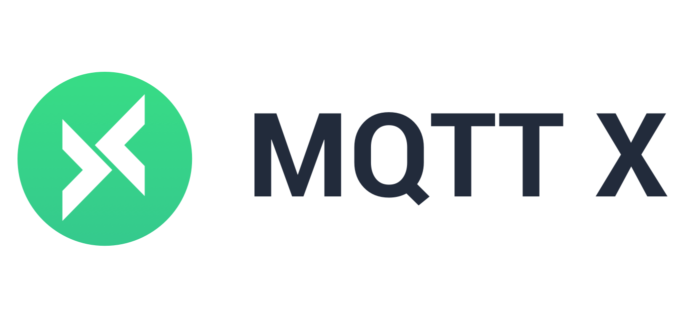
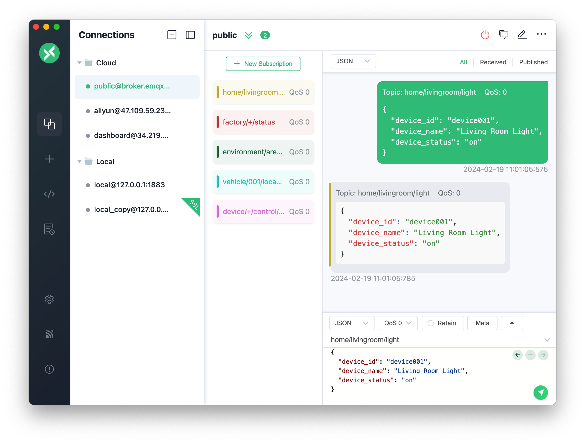

[](https://github.com/emqx/mqttx/releases)


[](https://github.com/emqx/mqttx/releases)
[](https://slack-invite.emqx.io/) [](https://discord.gg/xYGf3fQnES)
[](https://github.com/emqx/MQTTX/discussions)
[](https://www.youtube.com/channel/UCir_r04HIsLjf2qqyZ4A8Cg)
[](https://twitter.com/EMQTech)

---

[MQTT X](https://mqttx.app/zh) 是 [EMQ](https://www.emqx.com/zh) 开源的一款跨平台 MQTT 5.0 客户端工具，它支持 macOS, Linux, Windows，并且支持 MQTT 消息格式转换。

[MQTT X](https://mqttx.app/zh) 的用户界面借助聊天软件的形式简化了页面的操作逻辑，用户可以快速创建连接保存并同时建立多个连接客户端，方便用户快速测试 MQTT/TCP、MQTT/TLS、MQTT/WebSocket 的 **连接/发布/订阅** 功能及其他特性。

> [MQTT](http://mqtt.org/faq) 全称为 Message Queuing Telemetry Transport（消息队列遥测传输）是一种基于 发布/订阅 范式的“轻量级”消息协议，旨在用于受限设备和低带宽，高延迟或不可靠的网络，由 IBM 发布。

## 功能预览



## 安装

当前可从以下应用商店进行快速下载安装

### macOS App Store

[](https://apps.apple.com/cn/app/mqttx/id1514074565?mt=12)

### Homebrew

macOS 的用户还可以选择使用 [brew cask](https://formulae.brew.sh/cask/mqttx) 来安装 MQTT X

```shell
brew install --cask mqttx
```

### Linux

[](https://snapcraft.io/mqttx)
<a href='https://flathub.org/apps/details/com.emqx.MQTTX'></a>

### 发行包

请从 [GitHub Releases](https://github.com/emqx/MQTTX/releases) 下载符合您的版本并安装使用。

国内用户也可以从 [这里](https://www.emqx.com/zh/downloads/MQTTX/) 下载。

## 使用

详细使用，请查看我们的 [文档](https://mqttx.app/zh/docs) 或 [使用手册](./docs/manual.md)

1. MQTT Broker 准备。

   - 如果您不需要在本地部署 MQTT Broker，那么可以使用由 [EMQX Cloud](https://www.emqx.com/zh/cloud) 提供的[公共 MQTT 5.0 服务器](https://www.emqx.com/zh/mqtt/public-mqtt5-broker)来进行测试：

      ```shell
      Broker 地址: broker.emqx.io
      Broker TCP 端口: 1883
      Broker SSL 端口: 8883
      ```

   - 如果您打算部署一个本地运行的 MQTT Broker，那么我们推荐您 [下载 EMQX](https://www.emqx.com/zh/products/emqx) 进行安装和使用。EMQX 是一款开源云原生分布式物联网 MQTT 消息服务器。

2. 连接配置。点击左侧菜单栏里的 `+` 号按钮，并填写表单中相应的必填项。

3. 连接信息配置完成后，点击右上角的 `Connect` 按钮就可以创建一个连接并连接至 MQTT Broker。

4. MQTT 连接成功后，就可以进行 MQTT 的发布与订阅测试。


## 与 EMQX 更好的合作

MQTT X 为连接测试 EMQX 等 MQTT 消息服务器而生，一键式的连接方式和简洁的图形界面可以帮助您快速连接到 EMQX 或 EMQX Cloud 调试并探索其功能特性。

[注册 EMQX Cloud 可以享受 14 天免费试用](https://www.emqx.com/zh/try?product=cloud)

[现在就本地下载并安装 EMQX](https://www.emqx.com/zh/try?product=enterprise)

## 社区

- 访问 [EMQ 问答社区](https://askemq.com/) 以获取帮助，也可以分享您的想法或项目。
- 添加小助手微信号 `emqmkt`，加入 EMQ 微信技术交流群。
- 加入我们的 [Discord](https://discord.gg/xYGf3fQnES)，参于实时讨论。
- 关注我们的 [bilibili](https://space.bilibili.com/522222081)，获取最新物联网技术分享。
- 关注我们的 [微博](https://weibo.com/emqtt) 或 [Twitter](https://twitter.com/EMQTech)，获取 EMQ 最新资讯。

## 开发

Node 环境的推荐版本:

- v16.\*.\*

``` shell
# 克隆项目
git clone git@github.com:emqx/MQTTX.git

# 安装依赖
cd MQTTX
yarn install

# 编译和热重载以进行开发
yarn run electron:serve

# 编译和压缩以构建生产版本
yarn run electron:build
```

构建成功后，会在 `dist_electron` 目录里出现构建成功的相应的安装文件。

如果需要打包为独立操作系统的安装包，请参考以下命令：

```shell
# For Windows
yarn run electron:build-win

# For Linux
yarn run electron:build-linux

# For macOS
yarn run electron:build-mac
```

## 贡献

请确保在发出 PR 请求前， 已经仔细阅读过了[贡献指南](https://github.com/emqx/MQTTX/blob/main/.github/CONTRIBUTING_CN.md)

## 技术栈

- [Electron](https://electronjs.org/)
- [Vue](https://vuejs.org/) + [Element](https://element.eleme.io)
- [TypeScript](https://www.typescriptlang.org/)
- [TypeORM](https://github.com/typeorm/typeorm)
- [sqlite3](https://github.com/mapbox/node-sqlite3)
- [MQTT.js](https://github.com/mqttjs/MQTT.js)

## 相关资源

- [MQTT 入门及进阶](https://www.emqx.com/zh/mqtt)

  EMQ 提供了通俗易懂的技术文章及简单易用的客户端工具，帮助您学习 MQTT 并快速入门 MQTT 客户端编程。

- [MQTT SDKs](https://www.emqx.com/zh/mqtt-client-sdk)

  我们选取了各个编程语言中热门的 MQTT 客户端 SDK，并提供代码示例，帮助您快速掌握 MQTT 客户端库的使用。

## License

Apache License 2.0, see [LICENSE](https://github.com/emqx/MQTTX/blob/main/LICENSE).
