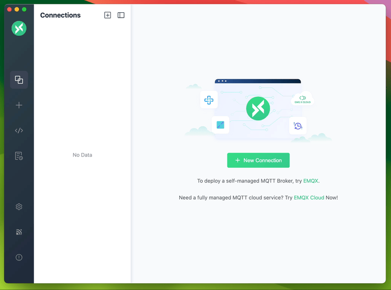

# MQTT X

[](https://github.com/emqx/mqttx/releases)

[](https://github.com/emqx/mqttx/releases)
[](https://slack-invite.emqx.io)
[](https://www.reddit.com/r/emqx/)
[](https://twitter.com/EMQTech)
[](https://askemq.com/c/tools/11)


[English](./README.md) | 简体中文 | [日本語](./README-JP.md)

---

[MQTT X](https://mqttx.app/zh) 是 [EMQ](http://emqx.cn) 开源的一款跨平台 MQTT 5.0 客户端工具，它支持 macOS, Linux, Windows，并且支持 MQTT 消息格式转换。

[MQTT X](https://mqttx.app/zh) 的用户界面借助聊天软件的形式简化了页面的操作逻辑，用户可以快速创建连接保存并同时建立多个连接客户端，方便用户快速测试 MQTT/TCP、MQTT/TLS、MQTT/WebSocket 的 **连接/发布/订阅** 功能及其他特性。

> [MQTT](http://mqtt.org/faq) 全称为 Message Queuing Telemetry Transport（消息队列遥测传输）是一种基于 发布/订阅 范式的“轻量级”消息协议，旨在用于受限设备和低带宽，高延迟或不可靠的网络，由 IBM 发布。

## 功能预览


## 安装

当前可从以下应用商店进行快速下载安装

### MacOS App Store

[](https://apps.apple.com/cn/app/mqttx/id1514074565?mt=12)

### Linux

[](https://snapcraft.io/mqttx)

### 发行包

请从 [GitHub Releases](https://github.com/emqx/MQTTX/releases) 下载符合您的版本并安装使用。

国内用户也可以从 [这里](https://www.emqx.cn/downloads/MQTTX/) 下载。

## 使用

详细使用，请查看我们的 [博客](https://www.emqx.cn/blog/mqtt-x-guideline) 或 [使用手册](./docs/manual.md)

1. MQTT Broker 准备。

   - 如果您不需要本地部署的 MQTT Broker，那么可以使用 [EMQ X](https://github.com/emqx/emqx) 的线上公开版进行快速测试；

      ```shell
      Broker 地址: broker.emqx.io
      Broker TCP 端口: 1883
      Broker SSL 端口: 8883
      ```

   - 如果您打算部署一个本地运行的 MQTT Broker，那么我们推荐您 [下载 EMQ X](https://github.com/emqx/emqx/releases) 进行安装使用。EMQ X 是一款完全开源，高度可伸缩，高可用的百万级分布式 MQTT 消息服务器，是 5G 时代万物互联的消息引擎，支持 MQTT/CoAP/LwM2M 一站式 IoT 协议接入。

2. 连接配置。点击左侧菜单栏里的 `+` 号按钮，并填写表单中相应的必填项。

3. 连接信息配置完成后，点击右上角的 `Connect` 按钮就可以创建一个连接并连接至 MQTT Broker。

4. MQTT 连接成功后，就可以进行 MQTT 的发布与订阅测试。



## 开发

``` shell
# 克隆项目
git clone git@github.com:emqx/MQTTX.git

# 安装依赖
cd MQTTX
yarn install

# 编译和热重载以进行开发
yarn run electron:serve

# 编译和压缩以构建生产版本
yarn run electron:build
```

构建成功后，会在 `dist_electron` 目录里出现构建成功的相应的安装文件。

如果需要打包为独立操作系统的安装包，请参考以下命令：

```shell
# For Windows
yarn run electron:build-win

# For Linux
yarn run electron:build-linux

# For MacOS
yarn run electron:build-mac
```

## 贡献

请确保在发出 PR 请求前， 已经仔细阅读过了[贡献指南](https://github.com/emqx/MQTTX/blob/master/.github/CONTRIBUTING_CN.md)

## 技术栈

- [Electron](https://electronjs.org/)
- [Vue](https://vuejs.org/) + [Element](https://element.eleme.io)
- [TypeScript](https://www.typescriptlang.org/)
- [Lowdb](https://github.com/typicode/lowdb)

## 联系方式

|  方式   | 内容  |
|  ----  | ----  |
| QQ 群（EMQ X 官方群3）| 937041105 |
| EMQ X 官方公众号 |  |
| EMQ X 微信群（扫码添加后邀请入群）|  |
| 微博 | [@emqtt](https://weibo.com/emqtt) |
| Twitter | [@emqtt](https://twitter.com/EMQTech/) |
| Slack | [EMQ X](https://slack-invite.emqx.io/) |

## License

Apache License 2.0, see [LICENSE](https://github.com/emqx/MQTTX/blob/master/LICENSE).
