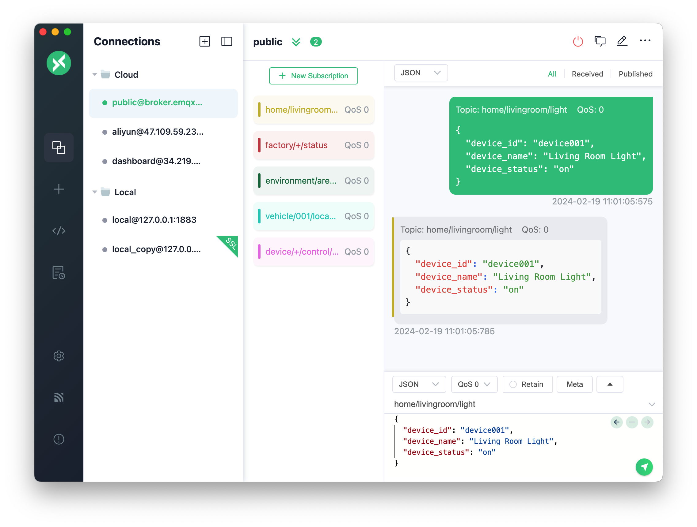

[](https://github.com/emqx/mqttx/releases)


[](https://github.com/emqx/mqttx/releases)
[](https://slack-invite.emqx.io/) [](https://discord.gg/xYGf3fQnES)
[](https://github.com/emqx/MQTTX/discussions)
[](https://www.youtube.com/channel/UC5FjR77ErAxvZENEWzQaO5Q)
[](https://twitter.com/EMQTech)

---

[MQTT X](https://mqttx.app/)は、[EMQ](https://www.emqx.com/en)によってオープンソース化されたクロスプラットフォームMQTT 5.0クライアントツールです。macOS、Linux、Windows、また、MQTTメッセージ形式の変換をサポートします。

[MQTT X](https://mqttx.app/)のユーザーインターフェイスは、チャットソフトウェアのような形でページの操作ロジックを簡素化します。ユーザーは、接続をすばやく作成し、複数の接続クライアントを同時に保存および確立できます。 MQTT/TCP、MQTT/TLS、MQTT/WebSocketの**接続/パブリッシュ/サブスクライブ**機能およびその他の機能をすばやくテストすることが便利です。

> [MQTT](http://mqtt.org/faq)（Message Queuing Telemetry Transport）は、パブリッシュ/サブスクライブパラダイムに基づいた「軽量」メッセージングプロトコルです。制約のあるデバイスや、低帯域幅、高遅延、または信頼性の低いネットワークで使用するように設計されています。IBMによって公開されています。

## 機能プレビュー



## インストール

現在、次のアプリストアからすばやくダウンロードしてインストールできます

### macOS App Store

[](https://apps.apple.com/jp/app/mqttx/id1514074565?mt=12)

### Homebrew

macOS ユーザーは、[brew cask](https://formulae.brew.sh/cask/mqttx) を使用して MQTT X をインストールできます。

```shell
brew install --cask mqttx
```

### Linux

[](https://snapcraft.io/mqttx)
<a href='https://flathub.org/apps/details/com.emqx.MQTTX'></a>

### リリースパッケージ

[GitHubリリース](https://github.com/emqx/MQTTX/releases)から自分に合ったバージョンをダウンロードしてインストールしてください。

## 利用方法

詳細な利用方法については、[ブログ](https://qiita.com/emqx_japan/items/1ff6097fdfe273c5e22f)または[ユーザーマニュアル](./docs/manual-jp.md)を確認してください。

1. MQTT Brokerの準備。

   - MQTT Brokerをローカルにデプロイするが必要ない場合は、[EMQX](https://github.com/emqx/emqx)のオンラインパブリックバージョンを使用して簡単にテストできます。

      ```shell
      Broker アドレス：broker.emqx.io
      Broker TCPポート：1883
      Broker SSLポート：8883
      ```

   - ローカルでMQTT Brokerを実行したい場合は、[EMQX Broker](https://github.com/emqx/emqx/releases)をインストールして使用することをお勧めします。 EMQX Brokerは、完全なオープンソース、高可用性、低レイテンシのミリオンレベルの分散型IoT MQTT 5.0メッセージサーバです。5G時代のIoTのメッセージングエンジンであり、MQTT/CoAP/LwM2MワンストップIoTプロトコルアクセスをサポートします。

2. 接続構成。左側のメニューバーの `+` ボタンをクリックし、フォームの必須項目を入力します。

3. 接続情報を設定したら、右上隅にある `Connect` ボタンをクリックして接続を作成し、MQTTブローカーに接続します。

4. MQTT接続が成功したら、MQTTのパブリッシュ/サブスクライブ機能をテストできます。


## 開発

``` shell
# Gitのリポジトリを複製する
git clone git@github.com:emqx/MQTTX.git

# 依存関係をインストールする
cd MQTTX
yarn install

# コンパイルとホットリロードして開発を始める
yarn run electron:serve

# コンパイルと圧縮して、製品バージョンをビルドする
yarn run electron:build
```

## プロジェクトへの貢献

PRを提出する前に、貢献ガイドをよく読んでください。[Contributing Guide](https://github.com/emqx/MQTTX/blob/main/.github/CONTRIBUTING.md)

## テクノロジースタック

- [Electron](https://electronjs.org/)
- [Vue](https://vuejs.org/) + [Element](https://element.eleme.io)
- [TypeScript](https://www.typescriptlang.org/)
- [TypeORM](https://github.com/typeorm/typeorm)
- [SQLite](https://github.com/mapbox/node-sqlite3)
- [MQTT.js](https://github.com/mqttjs/MQTT.js)

## License

Apache License 2.0, see [LICENSE](https://github.com/emqx/MQTTX/blob/main/LICENSE).
