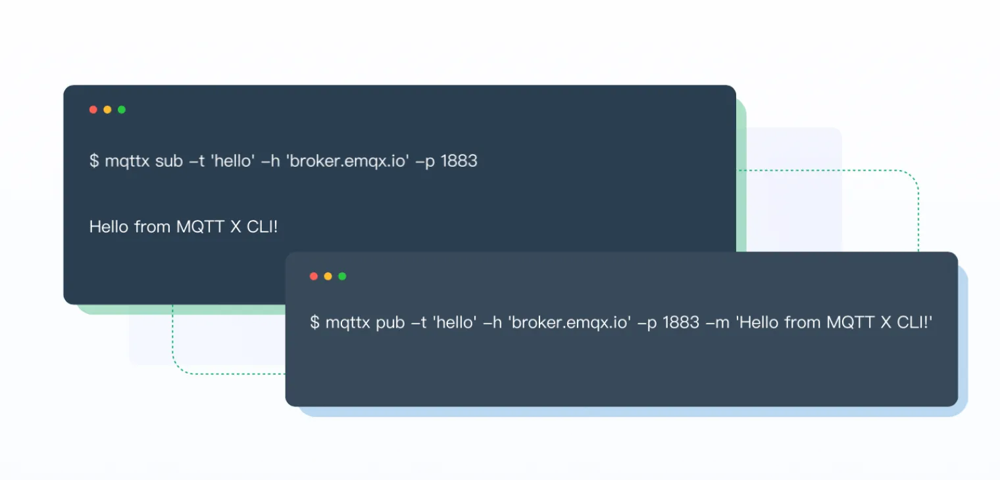

# MQTT X Command Line Interface

[](https://github.com/emqx/mqttx/releases)


[](https://github.com/emqx/mqttx/releases)
[](https://slack-invite.emqx.io/) [](https://discord.gg/xYGf3fQnES)
[](https://github.com/emqx/MQTTX/discussions)
[](https://www.youtube.com/channel/UC5FjR77ErAxvZENEWzQaO5Q)
[](https://twitter.com/EMQTech)

English | [简体中文](./README-CN.md)

---

[MQTT X CLI](https://mqttx.app) is an open source MQTT 5.0 command line client and MQTT X on the command line. Designed to help develop and debug MQTT services and applications faster without the need to use a graphical interface.

> [MQTT](http://mqtt.org/faq) stands for MQ Telemetry Transport. It is a publish/subscribe, extremely simple and lightweight messaging protocol, designed for constrained devices and low-bandwidth, high-latency or unreliable networks.

## Preview



## Installation

### macOS

To install the latest MQTTX CLI stable release on **macOS** using **binary download**.

> **Note**: Please note CPU architecture  of the current system environment

#### Intel Chip

```shell
curl -LO https://www.emqx.com/en/downloads/MQTTX/v1.8.0/mqttx-cli-macos-x64
sudo install ./mqttx-cli-macos-x64 /usr/local/bin/mqttx
```

#### Apple Silicon

```shell
curl -LO https://www.emqx.com/en/downloads/MQTTX/v1.8.0/mqttx-cli-macos-arm64
sudo install ./mqttx-cli-macos-arm64 /usr/local/bin/mqttx
```

#### Homebrew

Waiting for update...

### Linux

To install the latest MQTTX CLI stable release on **Linux** using **binary download**.

> **Note**: Please note CPU architecture  of the current system environment

#### x86-64

```shell
curl -LO https://www.emqx.com/en/downloads/MQTTX/v1.8.0/mqttx-cli-linux-x64
sudo install ./mqttx-cli-linux-x64 /usr/local/bin/mqttx
```

#### ARM64

```shell
curl -LO https://www.emqx.com/en/downloads/MQTTX/v1.8.0/mqttx-cli-linux-arm64
sudo install ./mqttx-cli-linux-arm64 /usr/local/bin/mqttx
```

### Windows

Windows users should go to the MQTT X [release page](https://github.com/emqx/MQTTX/releases) and find the `exe` package for the corresponding system architecture, download it manually and execute.

### Other platforms

Download packaged binaries from the [MQTT X releases page](https://github.com/emqx/MQTTX/releases).

## Usage

After installing it, run `mqttx` on the terminal

### Quickstart

Subscribe

```shell
mqttx sub -t 'hello' -h 'broker.emqx.io' -p 1883
```

Publish

```shell
mqttx pub -t 'hello' -h 'broker.emqx.io' -p 1883 -m 'from MQTTX CLI'
```

### Help

```shell
mqttx --help
```

| Options       | Description               |
| ------------- | ------------------------- |
| -V, --version | output the version number |
| -h, --help    | display help for command  |

| Command | Description                  |
| ------- | ---------------------------- |
| pub     | Publish a message to a topic |
| Sub     | Subscribes to a topic        |

#### Subscribe

```shell
mqttx sub --help
```

| Options                   | Description                                                         |
| ---------------------- | ------------------------------------------------------------ |
| -h, --hostname <HOST>  | the broker host (default: "localhost")                       |
| -p, --port <PORT>      | the broker port                                              |
| -i, --client-id <ID>   | the client id                                                |
| -q, --qos <0/1/2>      | the QoS of the message (default: 0)                          |
| --clean                | discard any pending message for the given id (default: true) |
| -t, --topic <TOPIC>    | the message topic                                            |
| -k, --keepalive <SEC>  | send a ping every SEC seconds (default: 30)                  |
| -u, --username <USER>  | the username                                                 |
| -P, --password <PASS>  | the password                                                 |
| -l, --protocol <PROTO> | the protocol to use, mqtt, mqtts, ws or wss                  |
| --key <PATH>           | path to the key file                                         |
| --cert <PATH>          | path to the cert file                                        |
| --ca                   | path to the ca certificate                                   |
| --insecure             | do not verify the server certificate                         |
| --will-topic <TOPIC>   | the will topic                                               |
| --will-message <BODY>  | the will message                                             |
| --will-qos <0/1/2>     | the will qos                                                 |
| --will-retain          | send a will retained message (default: false)                |
| -v, --verbose          | print the topic before the message                           |
| --help                 | display help for sub command                                 |

#### Publish

```shell
mqttx pub --help
```

| Options                   | Description                                                |
| ---------------------- | --------------------------------------------------- |
| -h, --hostname <HOST>  | the broker host                                     |
| -p, --port <PORT>      | the broker port                                     |
| -i, --client-id <ID>   | the client id                                       |
| -q, --qos <0/1/2>      | the QoS of the message (default: 0)                 |
| -t, --topic <TOPIC>    | the message topic                                   |
| -m, --message<MSG>     | the message body (default: "Hello From MQTT X CLI") |
| -r, --retain           | send a retained message (default: false)            |
| -s, --stdin            | read the message body from stdin                    |
| -M, --multiline        | read lines from stdin as multiple messages          |
| -u, --username <USER>  | the username                                        |
| -P, --password <PASS>  | the password                                        |
| -l, --protocol <PROTO> | the protocol to use, mqtt, mqtts, ws or wss         |
| --key <PATH>           | path to the key file                                |
| --cert <PATH>          | path to the cert file                               |
| --ca                   | path to the ca certificate                          |
| --insecure             | do not verify the server certificate                |
| --will-topic <TOPIC>   | the will topic                                      |
| --will-message <BODY>  | the will message                                    |
| --will-qos <0/1/2>     | the will qos (default: 0)                           |
| --will-retain          | send a will retained message (default: false)       |
| --help                 | display help for pub command                        |

## Better Together with EMQX

MQTT X is designed to connect to test MQTT Brokers such as EMQX, The one-click connection and simple graphical interface make it easy to connect to EMQX or EMQX Cloud to debug and explore functional features.

[Sign up EMQX Cloud for 14 days free trial](https://www.emqx.com/en/try?product=cloud)

[Download EMQX locally right now](https://www.emqx.com/en/try?product=enterprise)

## Community

The MQTT X community can be found on [GitHub Discussions](https://github.com/emqx/MQTTX/discussions), where you can ask questions, voice ideas, and share your projects.

To chat with other community members you can join the [EMQX Slack](https://slack-invite.emqx.io) or [Discord](https://discord.gg/xYGf3fQnES).

## Develop

Recommended version for Node environment:

- v14.\*.\*

``` shell
# Clone
git clone git@github.com:emqx/MQTTX.git

# Install dependencies
cd MQTTX/cli
yarn install

# Compiles and hot-reloads for development
yarn run dev

# Compiles and minifies for production
yarn run build
```

After a successful build, the corresponding file for the successful build will appear in the `libs` directory and will need to be used in a Node.js environment.

If you need to package a binary executable, please refer to the following command.

```shell
# 全局安装 pkg
npm install pkg -g

# 构建二进制可执行文件
pkg package.json
```

After a successful build, you will see the binary executable for each system in the `release` directory.

## Contributing

Please make sure to read the [Contributing Guide](https://github.com/emqx/MQTTX/blob/master/.github/CONTRIBUTING.md) before making a pull request.

## Technology Stack

- [TypeScript](https://www.typescriptlang.org/)
- [Node.js](https://nodejs.org/en/)
- [pkg](https://github.com/vercel/pkg)
- [MQTT.js](https://github.com/mqttjs/MQTT.js)

## License

Apache License 2.0, see [LICENSE](https://github.com/emqx/MQTTX/blob/master/LICENSE).
