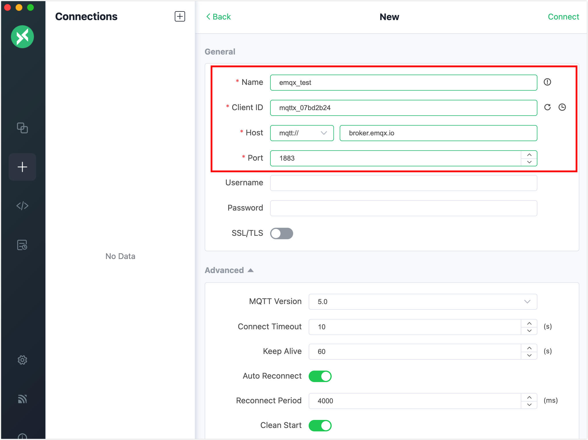
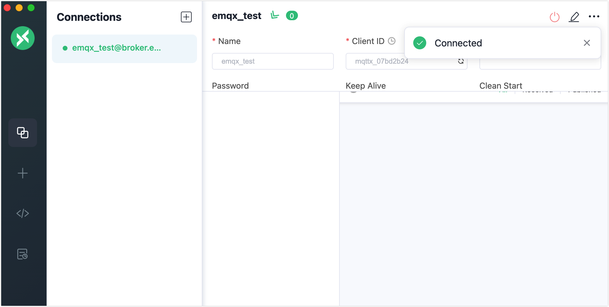
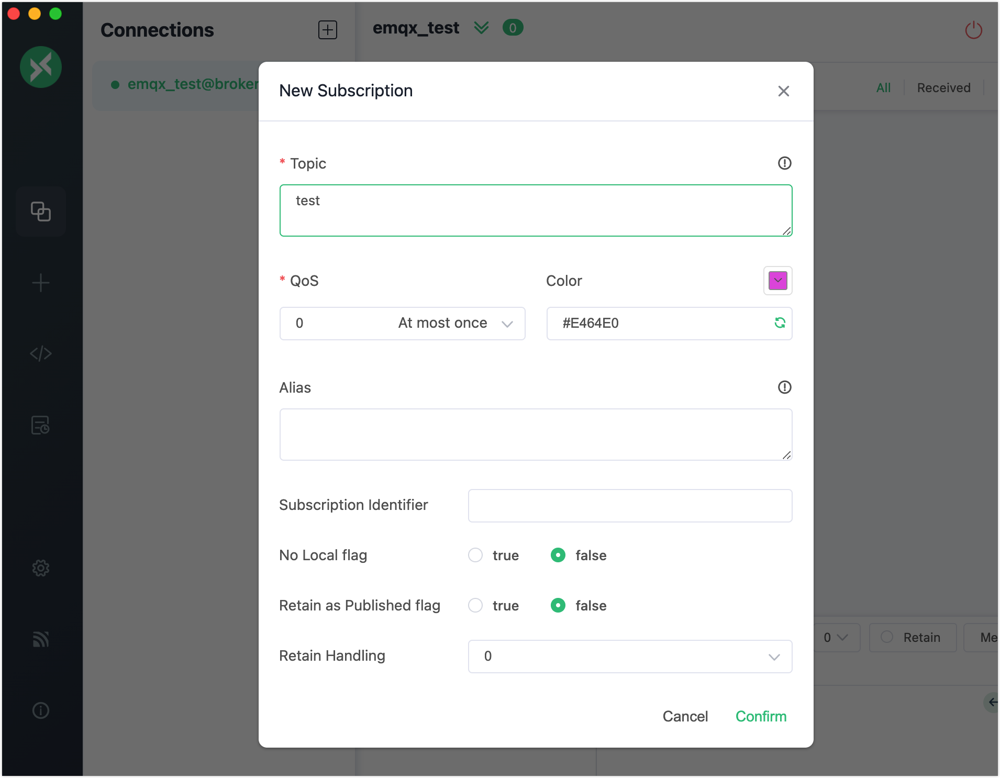
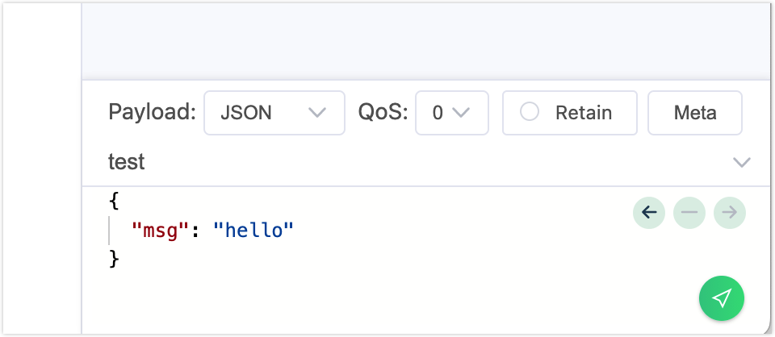
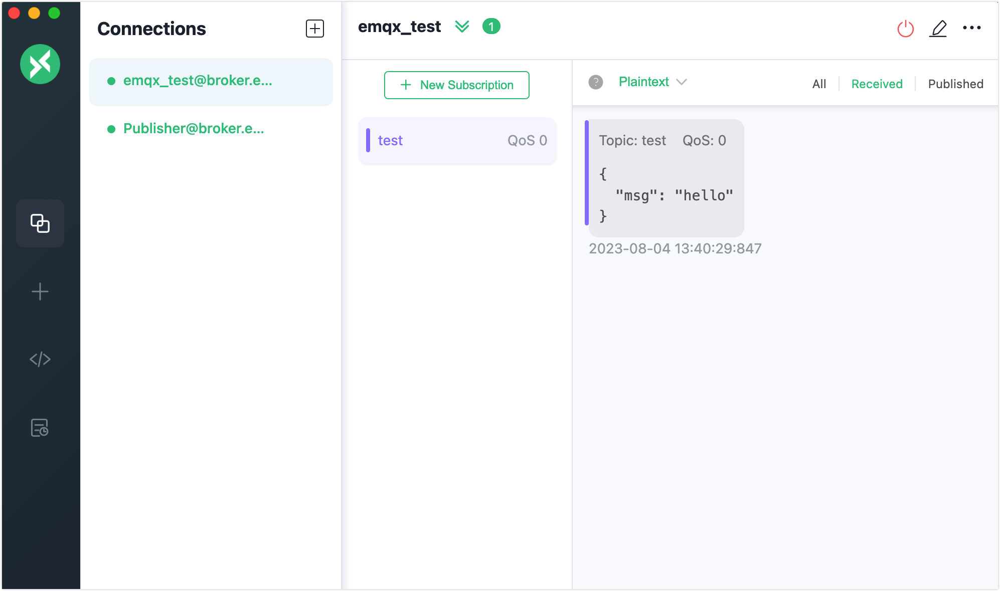

# Get Started

This page guides you to quickly start using the MQTTX Desktop to connect to MQTT broker and experience the basic publishing and subscribing operations.

## Prepare MQTT Broker

Before you get started, you need to prepare an MQTT Broker. You can choose either of the following brokers or an online MQTT service.

### Public MQTT Broker

For a quick test, you can use the free online [public MQTT Broker](https://www.emqx.com/en/mqtt/public-mqtt5-broker) without local deployment. It is an online public version of EMQX.

```shell
Broker address: broker.emqx.io
Broker TCP port: 1883
Broker SSL port: 8883
```

### Fully-Managed MQTT Cloud

You can also try the EMQX Cloud which is a fully managed, cloud-native MQTT Messaging Service for IoT. The EMQX Cloud allows you to create an MQTT Broker instantly in just a few minutes.

[Sign up for a 14-day free trial of EMQX Cloud](https://www.emqx.com/en/try?product=cloud)

*No credit card is required*.

### Self-Managed MQTT Broker

If you want to run an MQTT Broker locally, you are recommended to use [EMQX](https://www.emqx.com/en/products/emqx). It is the world’s most scalable and reliable MQTT messaging platform that can help you to connect, move and process your business data reliably in real time.

The easiest way to start and run EMQX is using Docker. Follow the steps below for download and installation.

1. To download and start the latest version of EMQX, enter the command below.

   Ensure [Docker](https://www.docker.com/) is installed and running before you execute this command.

   ```bash
   docker run -d --name emqx -p 1883:1883 -p 8083:8083 -p 8084:8084 -p 8883:8883 -p 18083:18083 emqx/emqx-enterprise:latest
   ```

2. Start your web browser and enter `http://localhost:18083/` ( `localhost` can be substituted with your IP address) in the address bar to access the [EMQX Dashboard](https://docs.emqx.com/en/enterprise/v5.1/dashboard/introduction.html), from where you can connect to your clients or check the running status.

   Default user name and password: `admin` and `public`

You can also install EMQX with a [download package](https://www.emqx.com/en/try?product=enterprise).

## Connect to MQTT Broker

This section demonstrates how to use the MQTTX Desktop to connect to the public MQTT broker with the most simple settings requested. For advanced and other settings, see [Configure General Settings], [Configure Advanced Settings] and [MQTT 5.0]. <!-- Add links later-->

1. Start your MQTT Broker and MQTTX Desktop. You can create a new client connection in either of the following 3 ways:

   - Click the **+** icon in the left navigation menu.

   - Click the **+ New Connection** button on the main pane.

   - Click **+** -> **New Connection** in the **Connections** pane.  


2. Enter the connection information of the MQTT broker in the **General** pane. To try a quick connection, you can just enter the name of the new connection, for example, `emqx_test,` and leave other options as default.

   - If you are using a self-managed MQTT broker, you can replace the hostname with the actual IP, such as `127.0.0.1`.

   ::: tip

   For detailed information about the options in the **General** section, see [Create Connection with Generals Settings](../use-desktop/connect.md).

   :::



3. Click **Connect** at the upper right corner and now you have established an MQTT client connection named `emqx_test`.



## Subscribe and Publish

This section demonstrates how to use the MQTTX Desktop to publish and subscribe to MQTT messages.

1. Click **+ New Subscription** in the main pane. On the pop-up window, enter `test` in the **Topic** text box and leave other options as default. Click **Confirm**. The client connection now subscribes to the `test` topic.

   ::: tip

   For a simple demonstration, it is not recommend to use the default topic `testtopic/#`, otherwise you will keep receiving messages if you are connected to the public MQTT broker.

   :::

   

2. Create a new MQTT client connection with the name as `Publisher` by following the steps in [Connect to MQTT Broker](#connect-to-mqtt-broker).

3. In the **Connections** pane, make sure that the client connection `Publisher` is selected. In the publishing area at the lower right corner, enter `test` as the topic and leave the message payload and other options as default.

   Click the send button and a number appears on the connection `emqx_test`, indicating that a new message is received.

   

4. Click the connection `emqx_test` in the **Connections** pane. You can view the received message from `Publisher`.

   
