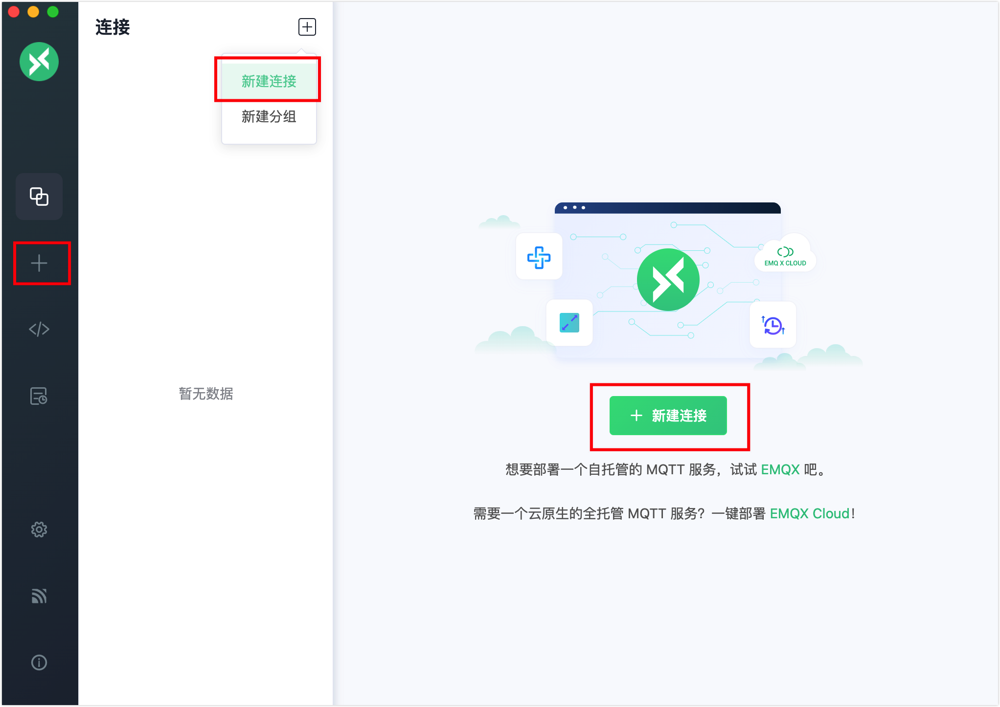
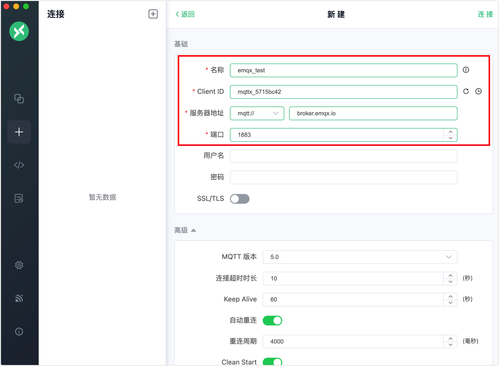
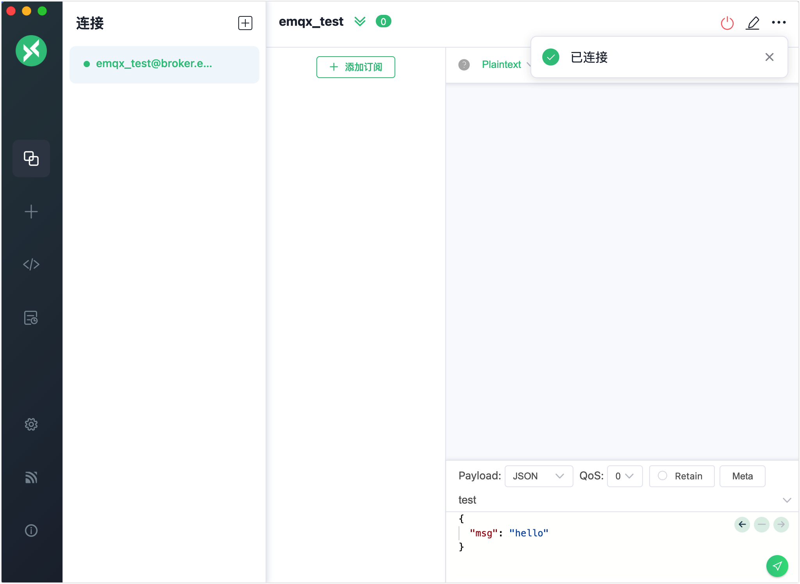
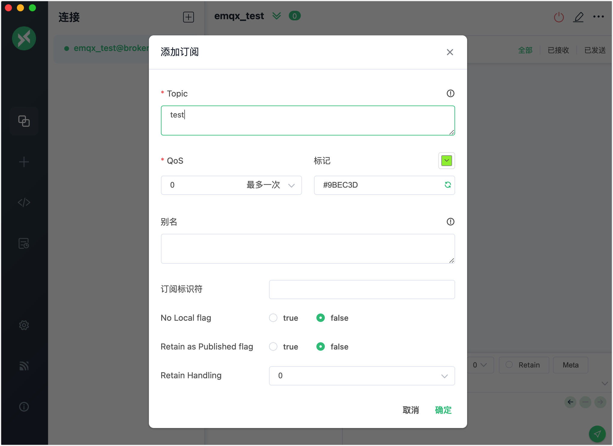
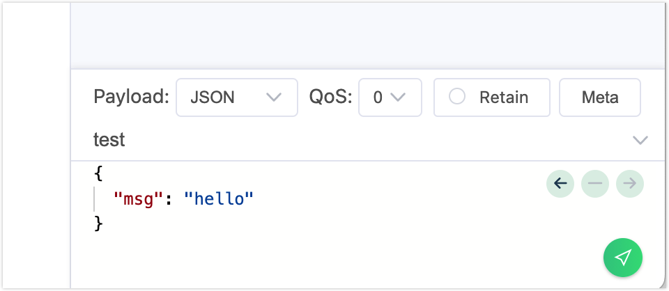
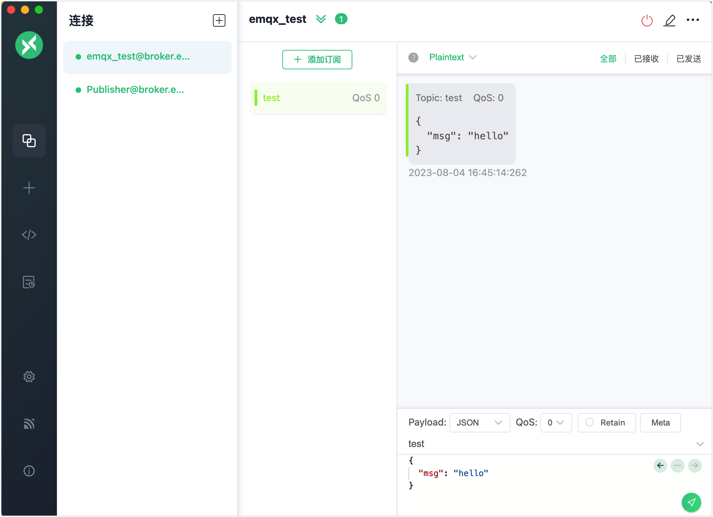

# 快速开始

本页面指导您快速开始使用 MQTTX 桌面版连接 MQTT 代理服务器并体验基本的发布和订阅操作。

## 准备 MQTT 服务器

在开始之前，您需要准备一个 MQTT 服务器。您可以选择以下任一 MQTT 服务器或在线 MQTT 服务。

### 公共 MQTT 服务器

为了快速测试，您可以使用免费的在线[公共 MQTT 代理](https://www.emqx.com/zh/mqtt/public-mqtt5-broker)而无需进行本地部署。这是 EMQX 的在线公共版本。

```shell
Broker address: broker.emqx.io
Broker TCP port: 1883
Broker SSL port: 8883
```

### 全托管云原生 MQTT 消息服务

EMQX 提供全托管的云原生 MQTT 消息服务，能够通过可靠、实时的物联网数据传输、处理和集成，连接大量的物联网设备。您可以在几分钟内创建一个 MQTT 服务。

[14 天免费试用](https://www.emqx.com/zh/try?product=cloud)

### 自行部署 MQTT 服务器

如果您想在本地运行 MQTT 服务器，我们建议使用 [EMQX](https://www.emqx.com/zh/products/emqx)。这是一款云原生分布式物联网 MQTT 消息服务器，能帮助您实时可靠地连接、转移和处理业务数据。

开始并运行 EMQX 的最简单方法是使用 Docker。您可以按照以下步骤下载和安装。

1. 下载并启动最新版本的 EMQX，请在执行以下命令之前确保已安装并运行 [Docker](https://www.docker.com/)。

   ```bash
   docker run -d --name emqx -p 1883:1883 -p 8083:8083 -p 8084:8084 -p 8883:8883 -p 18083:18083 emqx/emqx-enterprise:latest
   ```
   
2. 启动您的 Web 浏览器，输入 `http://localhost:18083/`（`localhost` 可以替换为您的 IP 地址）在地址栏中访问 [EMQX Dashboard](https://docs.emqx.com/zh/enterprise/v5.1/dashboard/introduction.html)，您可以在此连接客户端或查看运行状态。

   默认用户名和密码：`admin` 和 `public`

您还可以通过 [下载软件包](https://www.emqx.com/zh/try?product=enterprise) 安装 EMQX。

## 连接到 MQTT 服务器

本节演示了如何使用 MQTTX 桌面版通过最简单的设置连接到公共的 MQTT 服务器。想要了解其他高级设置，参阅[使用通用设置建立客户端连接]()，[使用高级设置建立客户端连接]() 和 [MQTT 5.0 功能设置]()。<!-- 完善链接-->

1. 启动您的 MQTT 服务器和 MQTTX 桌面端。您可以通过以下3种方式之一在 MQTTX 中创建新的客户端连接：

   - 在左侧导航菜单中点击 **+** 图标。

   - 在主面板上点击 **+ 新建连接** 按钮。

   - 在**连接**面板上点击 **+** -> **新建连接**。



2. 在**基础**区域输入 MQTT 服务器的连接信息。要尝试快速连接，您只需为新建的连接输入名称，例如 `emqx_test`，并将其他连接选项保留为默认设置。

   - 如果您使用的是自行部署的 MQTT 服务器，您可以将服务器地址替换为实际的 IP 地址，例如 `127.0.0.1`。

   ::: tip 

   关于**基础**部分中的选项的详细信息，请查看[使用基础设置创建连接](../use-desktop/connect.md)。

   :::




3. 点击右上角的**连接**。至此，您已经建立了一个名为 `emqx_test` 的 MQTT 客户端连接。



## 订阅与发布

本节演示了如何使用 MQTTX 桌面版发布和订阅 MQTT 消息。

1. 点击主面板中的 **+ 添加订阅**。在弹出窗口中， 在 **Topic** 文本框中输入 `test`，并保留其他选项为默认设置。点击**确定**。客户端连接现在订阅了 `test` 主题。

   ::: tip

   作为简单的演示，不建议使用默认主题 `testtopic/#`，否则如果您连接到公共 MQTT 代理服务器，您会不断收到消息。

   :::

   

2. 按照[连接到 MQTT 代理服务器](#connect-to-mqtt-broker)中的步骤，创建一个新的 MQTT 客户端连接，名称为 `Publisher`。

3. 在**连接**面板中，确保选择了客户端连接 `Publisher`。在右下角的发布区域中，输入 `test` 作为主题，并保留消息 payload 和其他选项为默认设置。

   点击发送按钮，连接 `emqx_test` 上出现一个数字，表示收到了一条新消息。

   

4. 在**连接**面板中选择 `emqx_test` 连接。 您可以查看 `Publisher` 发送的消息。

   
