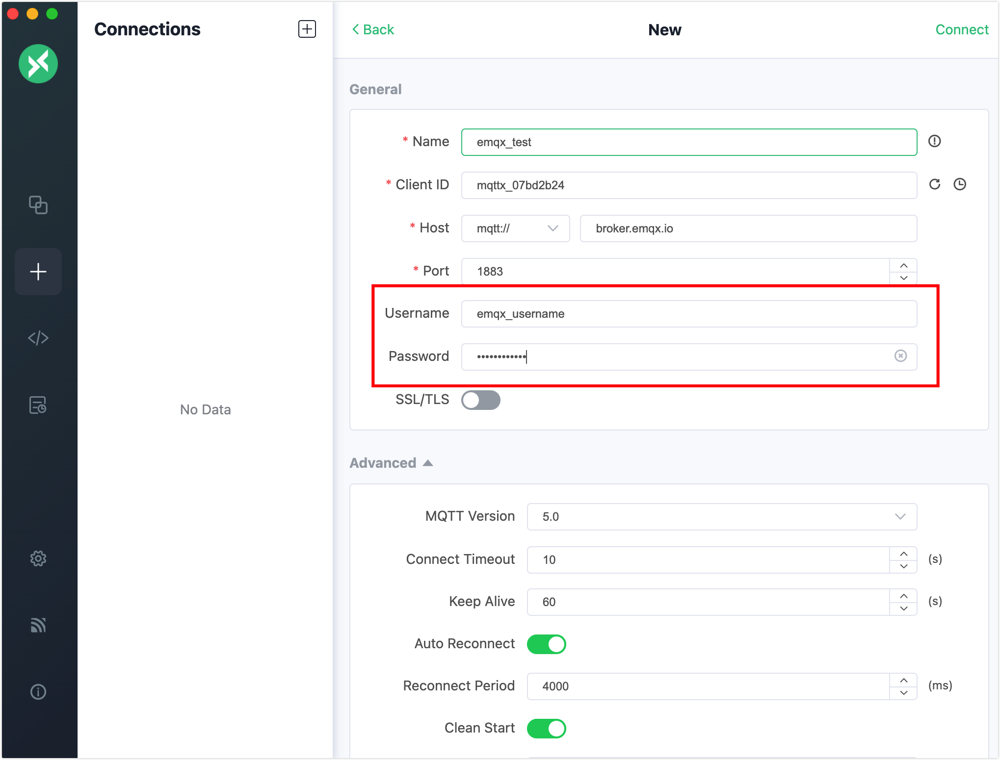
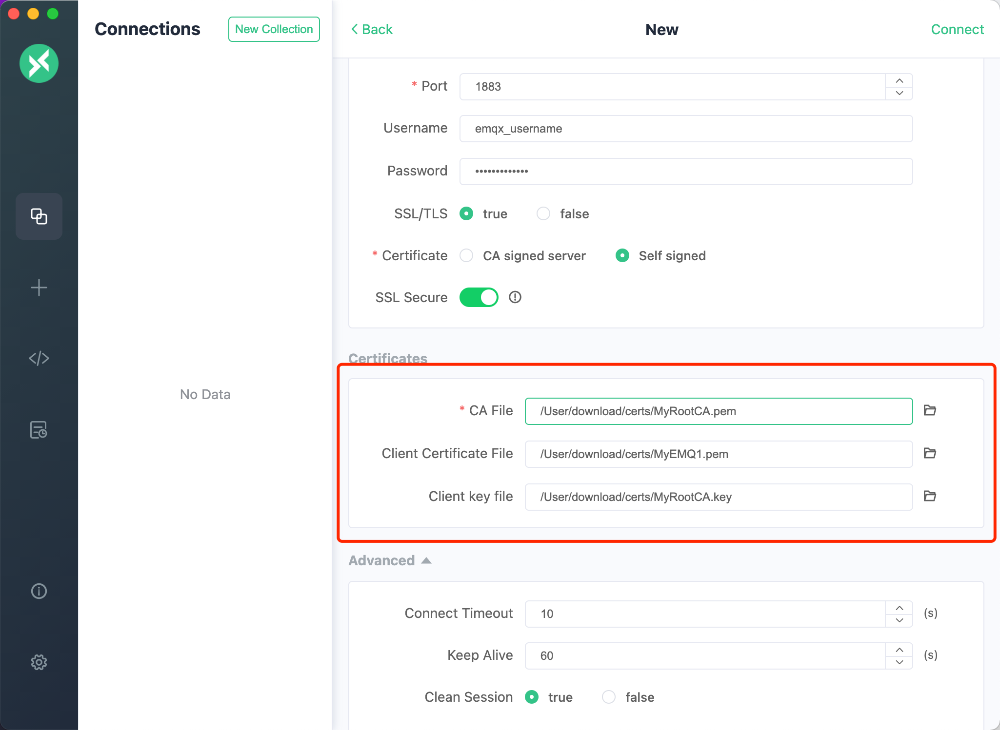
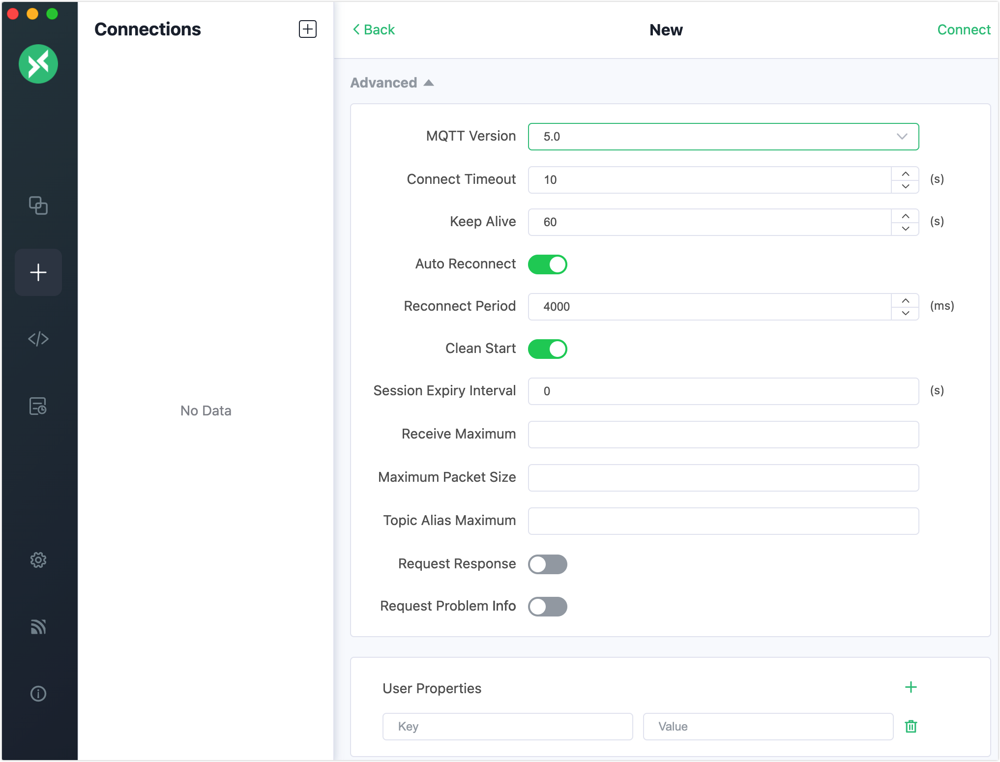

# Create Connection with General Settings

When you create a new connection, in the **General** section of the **New** pane, you can configure the information of the broker you connect to, the client authentication information, and SSL/TLS options.

## Broker Information

The broker information contains must-fill fields.  The **Client ID**, **Host**, and **Port** are already filled with default values. You can modify them based on the actual broker information.

- **Name**: Enter a connection, for example `emqx_test`.

- **Client ID**: It is the one and only identification of a client connection and can be automatically generated by clicking the refresh button next to the field.

- **Host**: Select the protocol to be used for the connection. Select `mqtt://` or `ws://`. If an SSL/TLS encrypted connection is used, you need to select `mqtts://` or `wss://`. The host IP address is set to `broker.emqx.io` by default, indicating you will connect to the public broker. If you are working with your own EMQX, replace it with the actual IP.

  - **Path**: Define the path for the WebSocket connection when `ws://` or `wss://` is selected as the protocol. It is used to find the correct endpoint on the server; default: `/mqtt`.

- **Port**: Enter the port corresponding to the selected protocol.

  | Protocol           | Port |
  | ------------------ | ---- |
  | mqtt:// or wss://  | 1883 |
  | mqtts:// or wss:// | 8883 |

## User Authentication

If your broker has enabled user user authentication, you need to enter the information in the **Username** and **Password** fields.

## SSL/TLS

You can establish a secured connection between MQTTX and the broker by enabling the SSL/TLS option.

- **SSL/TLS**: Enable or disable the SSL/TLS connection using the toggle switch; Disabled by default.

  - **SSL Secure**: You can enable or disable the client verification on the certificate chain and hostname of the server on which the broker is deployed during the connection.  When disabled, no verification is performed, allowing connections to be established with unverified servers.

    ::: tip

    Scenarios for disabling the SSL Secure:

    1. **Development Environment**: During development, for testing and debugging purposes, you can turn off the SSL secure switch to connect to unverified servers.

    2. **Internal Network**: In trusted internal networks without external access risk, consider turning off the SSL secure switch to simplify certificate management.

    However, disabling SSL Secure reduces security. In production environments or when communicating with external networks, it is recommended to enable the feature to ensure secure communications.

    :::

  - **CA signed server**: Verify the server through the Certificate Authority (CA) signed certificate.

  - **Self signed**: Verify the server through self-signed certificates. When selected, you need to configure the certificates. For a one-way authentication, only your `CA File` needs to be selected. For two-way authentication, you also need to configure the `Client Certificate File` and `Client key file`.

    - **CA File**: Select the CA file by clicking the folder icon.
    - **Client Certificate File**: Select the client certificate file by clicking the folder icon.
    - **Client key file**: Select the file by clicking the folder icon for two-way authentication.

    <!--To do: update the screenshot-->

## Configure Advanced Settings

In the Advanced section, you can configure the MQTT protocol-related features.

The default value of the **MQTT Version** is `5.0` and you can configure the MQTT 5.0 specific features such as `Session Expiry Interval`, `Receive Maximum`, and `Topic Alias Maximum` (optional). You can also select other MQTT protocol versions from the drop-down list. Other optional values are `3.1` and `3.1.1`.

For detailed information on the advanced settings, see [Advanced]. <!--To do: add links later-->

## Configure Last Will and Testament

In the **Last Will and Testament** section, you can configure options for will messages.

The `Last-Will-QoS` and `Last-Will-Retain` fields are preset with 0 and `False`, respectively. Input the `Last-Will-Topic` and `Last-Will-Payload` values to complete the Will Message configuration.

After completing the configuration, click the `Connect` button in the upper right corner to swiftly create a connection and connect to the MQTT Broker.
