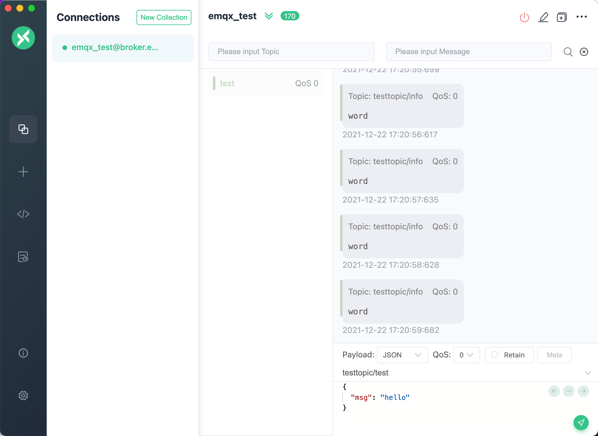

# MQTT X 使用手册

## 目录

- [简介](#简介)
- [下载安装](#下载安装)
- [使用](#使用)
- [开发指南](#开发指南)

## 简介

[MQTT X](https://mqttx.app) 是 [EMQ](http://emqx.io/cn) 开源的一款优雅的跨平台 MQTT 5.0 桌面客户端，它支持 macOS, Linux, Windows。

[MQTT X](https://mqttx.app) 的 `UI` 采用了聊天界面形式，简化了页面操作逻辑，用户可以快速创建连接，允许保存多个客户端，方便用户快速测试 `MQTT/MQTTS` 连接，及 `MQTT` 消息的订阅和发布。

在下载和安装前请访问我们的 [官网](https://mqttx.app) 或者是 [GitHub](https://github.com/emqx/MQTTX) 来了解并获取到最新的版本信息，使用最新版本有助于提高使用体验。如果你对本项目了解也可以直接 Clone [MQTT X](https://mqttx.app) 的仓库源码，自行打包和使用。使用过程中，有任何问题都可以到 [GitHub issues](https://github.com/emqx/MQTTX/issues) 来发表问题和看法或者是 Fork 我们的项目，并向我们提交修改后的 PR，我们将会认真查阅和回复。

### 快速预览


- 跨平台，支持 Windows，macOS，Linux
- 支持 MQTT v3.1.1 以及 MQTT v5.0
- 支持 CA、自签名证书，以及单、双向 SSL 认证
- 多主题 Light、Dark、Night（Purple）三种主题模式切换
- 支持简体中文以及英文
- 支持 WebSocket 连接至 MQTT 服务器
- 订阅 Topic 时可自定义颜色标记
- 支持 $SYS 主题自动订阅，并可按层级展开
- 支持多种 Payload 格式 Hex, Base64, JSON, Plaintext

## 下载安装

请从 [GitHub Releases](https://github.com/emqx/MQTTX/releases) 下载符合您的版本并安装使用。

如果出现网络原因，导致从 GitHub 下载时会出现网速较慢或卡顿的情况时，也可以点击 [这里](https://www.emqx.io/downloads/MQTTX/) ，选择符合您的版本并安装使用。

**注意**：下载时，请尽量选择下载最新版本。

- macOS

macOS 用户请优先选择下载 `dmg`  格式的安装包文件。也可以选择下载 `mac.zip` 的压缩包文件，解压后可快速使用。

**注意**：但是对于 `macOS` 系统版本不同，使用 `zip` 压缩包在 `10.15.2` 系统版本中可能会出现解压后无法打开的情况，因此请优先选择 `dmg` 文件。

- Windows

Windows 用户请下载最新版本的 `exe` 文件，下载后可根据 Setup 的提示进行安装操作。

- Linux

Linux 用户请下载最新版本的 `AppImage` 文件或使用 `snap` 文件进行快速安装。

对于使用 `snap` 格式文件进行安装的，还可以执行该命令，快速安装：

```shell
sudo snap install mqttx
```

**注意**：在使用 `snap` 文件安装时，可能会出现权限不够无法安装的问题，详情可参考这条 `issue` [https://github.com/emqx/MQTTX/issues/109](https://github.com/emqx/MQTTX/issues/109)

## 使用

### MQTT Broker 准备

- 如果您不需要本地部署的 MQTT Broker，那么可以使用 [EMQ X](https://github.com/emqx/emqx) 的线上公开版进行快速测试；

  ```shell
  Broker 地址: broker.emqx.io
  Broker TCP 端口: 1883
  Broker SSL 端口: 8883
  ```

- 如果您打算部署一个本地运行的 MQTT Broker，那么我们推荐您 [下载 EMQ X](https://github.com/emqx/emqx/releases) 进行安装使用。EMQ X 是一款完全开源，高可用低时延的百万级分布式物联网 MQTT 5.0 消息服务器。

  使用 Docker 快速安装 EMQ X：

  ```shell
  docker run -d --name emqx -p 1883:1883 -p 8083:8083 -p 8883:8883 -p 8084:8084 -p 18083:18083 emqx/emqx
  ```

### 快速建立连接

在准备好 MQTT Broker 后，进入到主程序页面，可点击左侧菜单栏中的 `+` 号，如果页面没有数据，还可以直接点击右侧的 `新建连接` 按钮，快速配置一个新的客户端连接。


### 客户端相关信息

进入到创建页面后，需配置或填写连接客户端的相关信息。

1. Broker 信息

    配置 `Broker` 信息时，`Client ID`、`Host` 和 `Port` 已经默认填写，您也可根据实际的 `Broker` 信息自行修改。点击 `Client ID` 右侧的刷新按钮，可快速生成新的 `Client ID`。

    `Host` 前的选择框，用来选择该连接的协议，支持 `mqtt://`，`ws://`，如果是 `SSL/TLS` 认证连接的话，需要修改为 `mqtts://`，`wss://`。

    **注意**：当协议修改时，需要修改连接的端口。


2. 用户认证信息

    如果您的 Broker 开启了用户认证，配置项中可填写 `Username` 和 `Password` 信息。


3. SSL/TLS

    当需要开启 `SSL/TLS` 认证时，只需要将配置中的 `SSL/TLS` 配置项设置为 `true`，并提供了 `CA signed self` 和 `Self signed` 两种方式。

    如果选择了 `Self signed`，可进行证书配置，点击最右侧的文件夹按钮，选择您已经生成好的各项证书，如果是单向连接，只需要选择您的 `CA File` 即可，如果是双向认证，还需要选择配置 `Client Certificate File` 和 `Client key file`。


4. 高级配置

    高级配置中，可以配置`连接超时时长`、`KeepAlive`、`Clean Session`、`自动重连`、`MQTT Version` 等。

5. MQTT 5.0

    在高级配置中，可以选择 MQTT 的协议版本，支持 MQTT v3.1.1 和 MQTT v5.0 版本，默认为 v3.1.1, 如果选择了 v5.0 版本后，还可配置 `Session Expiry Interval`、`Receive Maximum`（可选）。


6. 遗嘱消息

    在高级配置下方的配置卡片中，可以配置遗嘱消息，`Last-Will-QoS` 和 `Last-Will-Retain` 的值默认填充为 0 和 `False`，当您输入 `Last-Will-Topic` 和 `Last-Will-Payload` 的值后，就可以完成对遗嘱消息的配置。


配置完成后，点击右上角的 `Connect` 按钮就可以快速创建一个连接并连接至 MQTT Broker。

### 消息的发布订阅

1. 主界面

    连接成功后，即可进入到连接的主界面，点击顶部连接名称旁的折叠按钮，可以展开并显示该配置的几个基础信息，方便快速修改该连接的几个常用配置，修改时需断开连接，重新点击连接后即可生效，每次连接成功后，面板都会自动往上折叠。在断开连接的状态下，也可点击右边配置按钮，进行更多的连接配置修改。


2. 添加订阅

    点击左下角的 `New Subscription` 按钮，可以快速添加一个 `Topic`，每个 `Topic` 都可以用一种颜色标记，可以随机生成或打开颜色选择器选择。订阅列表顶部的最右侧的按钮，可以隐藏订阅列表，来显示页面更多的空间。


3. 消息发送和接收

    `Topic` 订阅成功后，就可以来测试消息的收发了。在页面右下角填入刚才所订阅的 `Topic` 信息，可选择 `QoS`，`Retain` 的值，输入 `payload` 后，点击最右侧的发送按钮，就向刚才订阅的 `Topic` 发送了一条消息。发送成功后，也可以即时接收到刚才所发送的消息。注意，在消息框内，右边栏为发送的消息。左边栏为接收到的消息。macOS 用户可以使用 `command + enter` 快捷键，其它用户可以使用 `control + enter` 快捷键来快速发送消息。

    消息栏的 `payload` 选项，可以快速将消息转化为多种格式，支持 `Base64`，`Hex`，`JSON` 和 `Plaintext`。


至此就完成了一条 `MQTT` 消息的测试。

### 设置

点击左侧菜单栏底部的设置按钮，或使用快捷键，macOS 用户可以使用 `command + ,` 快捷键，其它用户可以使用 `control + ,` 快捷键来跳转到设置页面，目前支持选择语言，开启是否自动检查更新和选择主题。


### 其它

1. 连接操作

    点击顶部的操作栏按钮，可以快速断开连接，删除当前连接等。


2. 消息处理

    在消息栏右上角的 `All`，`Received`， `Published` 按钮可以过滤出
    全部消息，已接收的消息，和已发布的消息。

    点击顶部的操作栏按钮，选择 `Search by Topic` 项，或使用快捷键，macOS 用户可以使用 `command + f` 快捷键，其它用户可以使用 `control + f` 快捷键，来打开按 `Topic` 搜索的的功能，支持主题的模糊查询。

    点击顶部的操作栏按钮，选择 `Clear Histroy` 项，可以快速清空当前连接所发送和接收的消息。



3. 检查更新

    点击左侧底部的 `i` 按钮，可进入到 `About` 页面，了解 [MQTT X](https://mqttx.app) 的版本信息和 [EMQ X](https://emqx.io) 的相关信息。点击 `Check for Updates` 可以检查是否有更新版本。


4. 最大重连数

    在自动检查更新的下方，有一个最大重连数设置，可以设置一个整数，当 `Broker` 断开，或者连接不上的情况下时，重连次数超过该数值，连接将会彻底断开。

## 开发指南

开发时，本机需要具有 `Node`，`Git` 环境，并需要了解 `npm`，`Vue.js`，`Electron`，`TypeScript` 等相关知识。

``` shell
# Fork & Clone 项目
git clone git@github.com:${name}/MQTTX.git

# 安装依赖
cd MQTTX
yarn install

# 编译和热重载以进行开发
yarn run electron:serve

# 编译和压缩以构建生产版本
yarn run electron:build
```

构建成功后，会在 `dist_electron` 目录里出现构建成功的相应安装文件。

如果你只需 build 指定系统的安装包，请自行修改 `package.json` 中 `electron:build` 所对应的命令行语句：

macOS: `vue-cli-service electron:build --mac`

Windows: `vue-cli-service electron:build --win`

Linux: `vue-cli-service electron:build --linux`

## 联系方式

|  方式   | 内容  |
|  ----  | ----  |
| QQ 群（EMQ X 官方群3）| 937041105 |
| EMQ X 官方公众号 |  |
