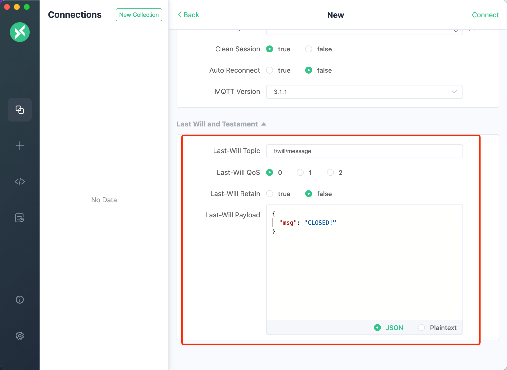
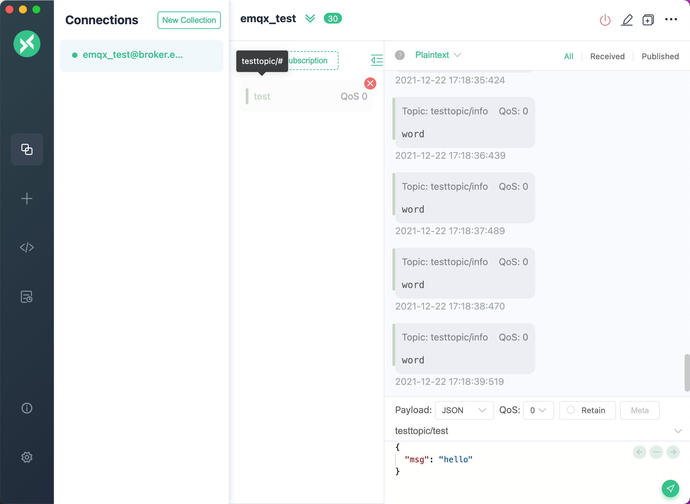
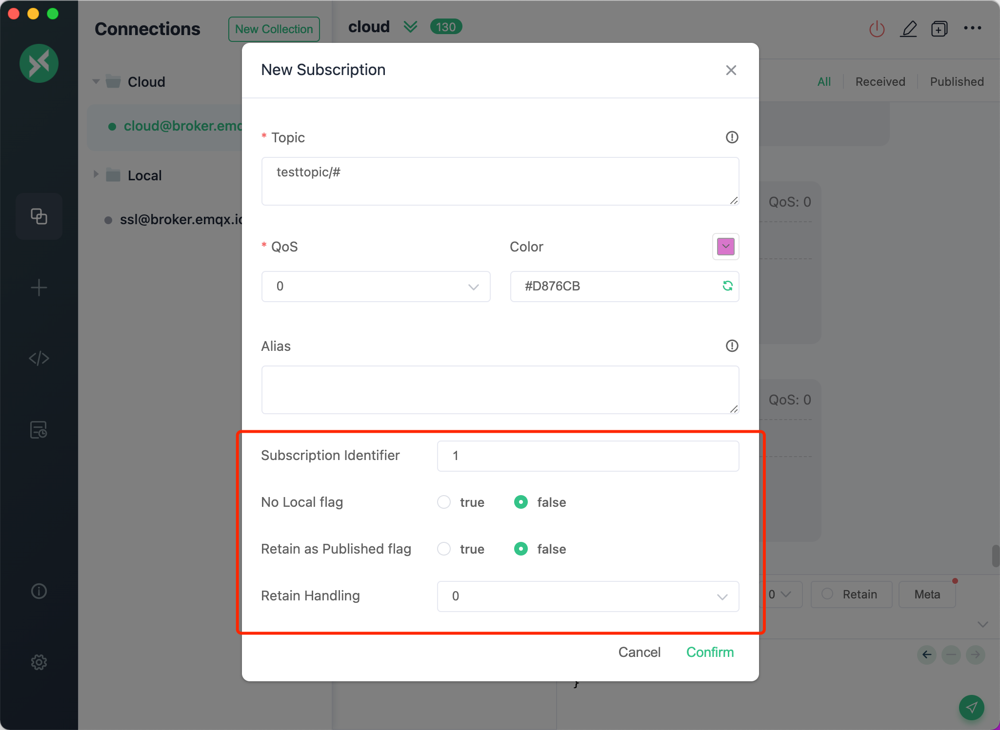
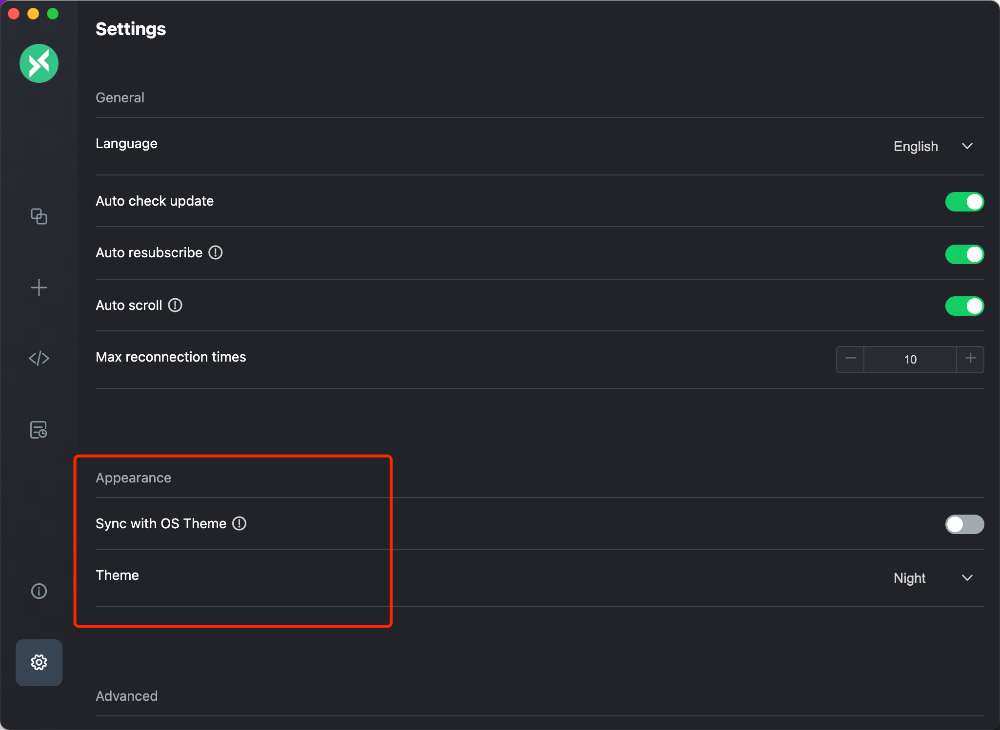
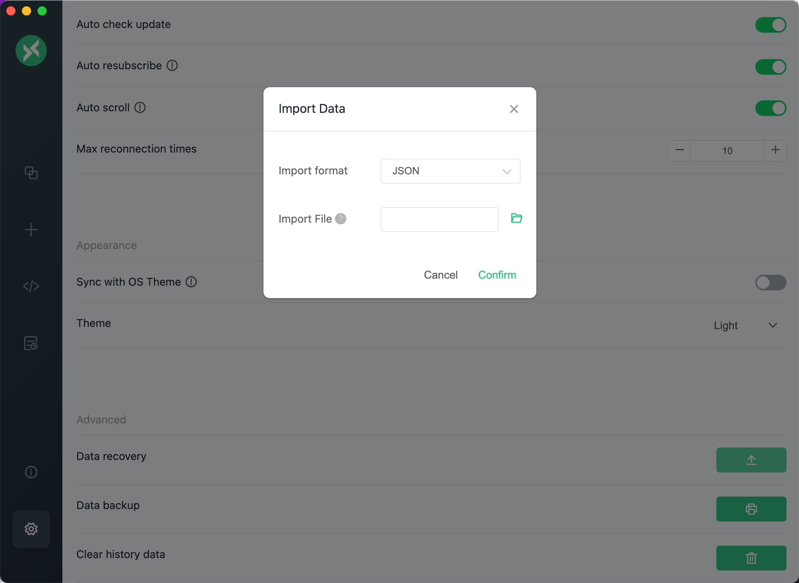
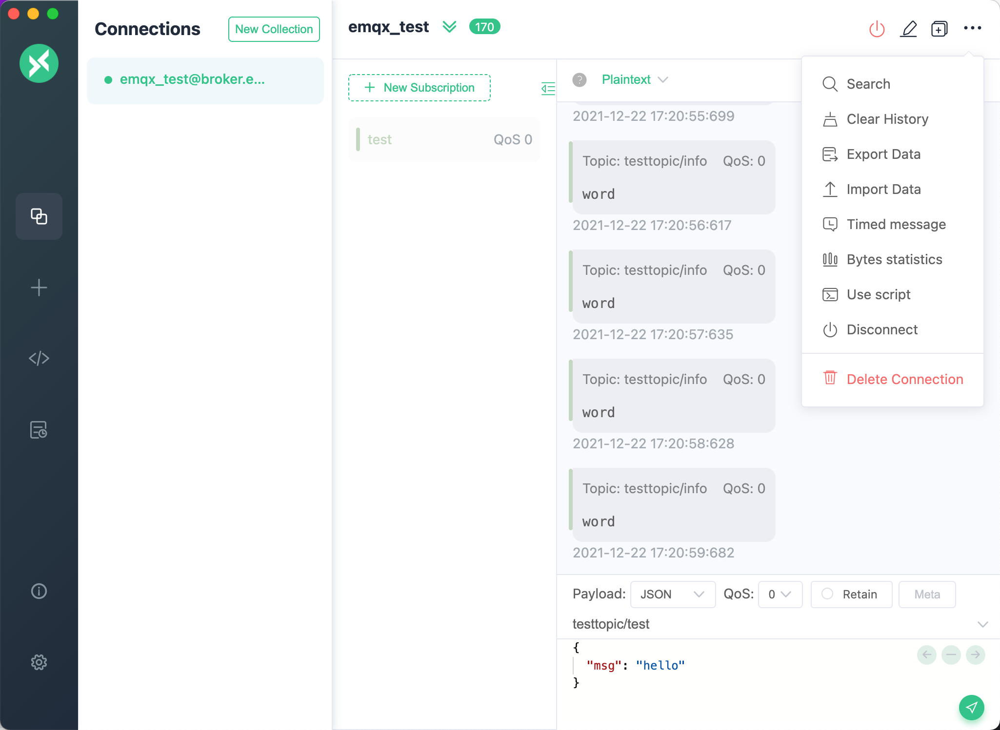
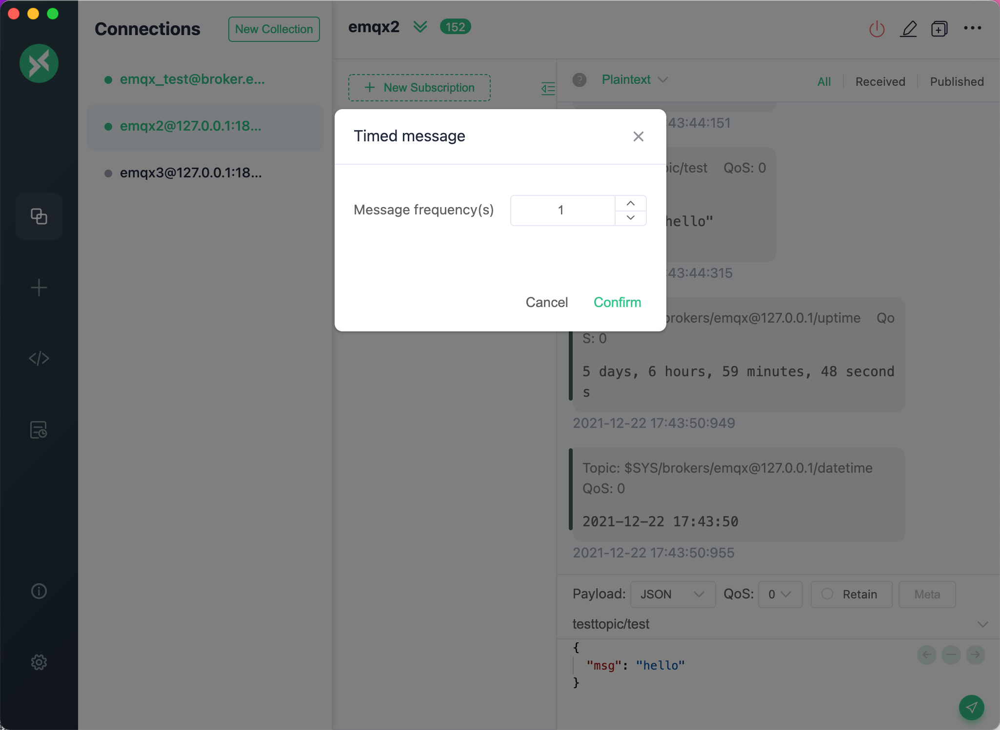

# MQTT X 使用手册

## 目录

- [简介](#简介)
- [下载安装](#下载安装)
- [使用](#使用)
- [开发指南](#开发指南)

## 简介

[MQTT X](https://mqttx.app/zh) 是 [EMQ](http://emqx.cn) 开源的一款优雅的跨平台 MQTT 5.0 桌面客户端，它支持 macOS, Linux, Windows。

[MQTT X](https://mqttx.app/zh) 的 `UI` 采用了聊天界面形式，简化了页面操作逻辑，用户可以快速创建连接，允许保存多个客户端，方便用户快速测试 `MQTT/MQTTS` 连接，及 `MQTT` 消息的订阅和发布。

在下载和安装前请访问我们的 [官网](https://mqttx.app/zh) 或者是 [GitHub](https://github.com/emqx/MQTTX) 来了解并获取到最新的版本信息，使用最新版本有助于提高使用体验。如果你对本项目了解也可以直接 Clone [MQTT X](https://mqttx.app/zh) 的仓库源码，自行打包和使用。使用过程中，有任何问题都可以到 [GitHub issues](https://github.com/emqx/MQTTX/issues) 来发表问题和看法或者是 Fork 我们的项目，并向我们提交修改后的 PR，我们将会认真查阅和回复。

### 快速预览


- 跨平台，支持 Windows，macOS，Linux
- 支持 MQTT v3.1.1 以及 MQTT v5.0
- 支持 CA、自签名证书，以及单、双向 SSL 认证
- 多主题 Light、Dark、Night（Purple）三种主题模式切换
- 支持简体中文以及英文
- 支持 WebSocket 连接至 MQTT 服务器
- 订阅 Topic 时可自定义颜色标记
- 支持 $SYS 主题自动订阅，并可按层级展开
- 支持多种 Payload 格式 Hex, Base64, JSON, Plaintext

## 下载安装

请从 [GitHub Releases](https://github.com/emqx/MQTTX/releases) 下载符合您的版本并安装使用。

如果出现网络原因，导致从 GitHub 下载时会出现网速较慢或卡顿的情况时，也可以点击 [这里](https://www.emqx.cn/downloads/MQTTX/) ，选择符合您的版本并安装使用。

**注意**：下载时，请尽量选择下载最新版本。

- macOS

对于 macOS 用户，首选建议从 Mac App Store 下载。

[](https://apps.apple.com/cn/app/mqttx/id1514074565?mt=12)

当需要下载文件安装时，请优先选择下载 `dmg`  格式的安装包文件。也可以选择下载 `mac.zip` 的压缩包文件，解压后可快速使用。

**注意**：但是对于 `macOS` 系统版本不同，使用 `zip` 压缩包在 `10.15.2` 系统版本中可能会出现解压后无法打开的情况，因此请优先选择 `dmg` 文件。

- Windows

Windows 用户请下载最新版本的 `exe` 文件，下载后可根据 Setup 的提示进行安装操作。

- Linux

Linux 用户请下载最新版本的 `AppImage` 文件或使用 `snap` 文件进行快速安装。

对于使用 `snap` 格式文件进行安装的，还可以执行该命令快速安装，或直接访问 Snap Store 或 Flathub：

[](https://snapcraft.io/mqttx)
<a href='https://flathub.org/apps/details/com.emqx.MQTTX'></a>

```shell
sudo snap install mqttx
```

**注意**：在使用 `snap` 文件安装时，可能会出现权限不够无法安装的问题，详情可参考这条 `issue` [https://github.com/emqx/MQTTX/issues/109](https://github.com/emqx/MQTTX/issues/109)

## 使用

### MQTT Broker 准备

- 如果您不需要本地部署的 MQTT Broker，那么可以使用 [EMQ X](https://github.com/emqx/emqx) 的线上公开版进行快速测试；

  ```shell
  Broker 地址: broker.emqx.io
  Broker TCP 端口: 1883
  Broker SSL 端口: 8883
  ```

- 如果您打算部署一个本地运行的 MQTT Broker，那么我们推荐您 [下载 EMQ X](https://github.com/emqx/emqx/releases) 进行安装使用。EMQ X 是一款完全开源，高可用低时延的百万级分布式物联网 MQTT 5.0 消息服务器。

  使用 Docker 快速安装 EMQ X：

  ```shell
  docker run -d --name emqx -p 1883:1883 -p 8083:8083 -p 8883:8883 -p 8084:8084 -p 18083:18083 emqx/emqx
  ```

### 快速建立连接

在准备好 MQTT Broker 后，进入到主程序页面，可点击左侧菜单栏中的 `+` 号，如果页面没有数据，还可以直接点击右侧的 `新建连接` 按钮，快速配置一个新的客户端连接。


### 客户端相关信息

进入到创建页面后，需配置或填写连接客户端的相关信息。

1. Broker 信息

    配置 `Broker` 信息时，`Client ID`、`Host` 和 `Port` 已经默认填写，您也可根据实际的 `Broker` 信息自行修改。点击 `Client ID` 右侧的刷新按钮，可快速生成新的 `Client ID`。

    `Host` 前的选择框，用来选择该连接的协议，支持 `mqtt://`，`ws://`，如果是 `SSL/TLS` 认证连接的话，需要修改为 `mqtts://`，`wss://`。

    **注意**：当协议修改时，需要修改连接的端口。


2. 用户认证信息

    如果您的 Broker 开启了用户认证，配置项中可填写 `Username` 和 `Password` 信息。


3. SSL/TLS

    当需要开启 `SSL/TLS` 认证时，只需要将配置中的 `SSL/TLS` 配置项设置为 `true`，并提供了 `CA signed self` 和 `Self signed` 两种方式。

    如果选择了 `Self signed`，可进行证书配置，点击最右侧的文件夹按钮，选择您已经生成好的各项证书，如果是单向连接，只需要选择您的 `CA File` 即可，如果是双向认证，还需要选择配置 `Client Certificate File` 和 `Client key file`。当开启 `Strict validate Certificate` 的选项后，会启用更完整的证书验证连接，一般推荐在需要测试正式环境时启用。


4. 高级配置

    高级配置中，可以配置`连接超时时长`、`KeepAlive`、`Clean Session`、`自动重连`、`MQTT Version` 等。

5. MQTT 5.0

    在高级配置中，可以选择 MQTT 的协议版本，支持 MQTT v3.1.1 和 MQTT v5.0 版本，默认为 v3.1.1, 如果选择了 v5.0 版本后，还可配置 `Session Expiry Interval`、`Receive Maximum` 和 `Topic Alias Maximu`（可选）。


6. 遗嘱消息

    在高级配置下方的配置卡片中，可以配置遗嘱消息，`Last-Will-QoS` 和 `Last-Will-Retain` 的值默认填充为 0 和 `False`，当您输入 `Last-Will-Topic` 和 `Last-Will-Payload` 的值后，就可以完成对遗嘱消息的配置。



配置完成后，点击右上角的 `Connect` 按钮就可以快速创建一个连接并连接至 MQTT Broker。

### 消息的发布订阅

1. 主界面

    连接成功后，即可进入到连接的主界面，点击顶部连接名称旁的折叠按钮，可以展开并显示该配置的几个基础信息，方便快速修改该连接的几个常用配置，修改时需断开连接，重新点击连接后即可生效，每次连接成功后，面板都会自动往上折叠。在断开连接的状态下，也可点击右边配置按钮，进行更多的连接配置修改。


2. 添加订阅

    点击左下角的 `New Subscription` 按钮，可以快速添加一个 `Topic`，每个 `Topic` 都可以用一种颜色标记，可以随机生成或打开颜色选择器选择。订阅列表顶部的最右侧的按钮，可以隐藏订阅列表，来显示页面更多的空间。添加完成后，点击订阅列表中已经订阅的 Topic 项，可以实现消息过滤，消息视图内将只显示订阅了当前主题的消息内容，再次点击即可取消过滤；也可直接点击其它已订阅的 Topic 项，查看其对应的消息内容。而点击 Topic 名称，即可快速复制当前的 Topic 信息。当需要向该 Topic 发送消息时，只需快速粘贴到消息栏的 Topic 输入框内进行修改，便可快速完成该操作。


    在添加 `Topic` 时，可以给每个 Topic 设置一个别名，该选项为一个可选项，当设置并添加完成订阅后，订阅列表中的 `Topic` 数据将以别名展示，鼠标悬浮到 `Topic` 项时，提示框也会同时展示出该 `Topic` 的原值。这对于需要监控查看的多个 `Topic` 过长，无法分辩 `Topic` 的具体含义时，具有较强的帮助性。



    我们打开订阅主题的弹出框后，在 Topic 输入框内，输入多个 Topic 并使用逗号（,）进行分割，点击确认订阅成功后，我们可以看到订阅列表中包含了多个 Topic。对于使用客户端层的别名功能也可以支持同时对多个 Topic 进行设置，同理使用逗号分隔（,）。


    订阅过的主题支持**编辑/禁用/启用**，右键点击已经订阅过的 Topic 列表项，在右键菜单中我们可以快速选择编辑、禁用或启用等操作。当订阅的 Topic 过多时，有时候不是所有的 Topic 消息都想要接收到，为了避免再次订阅相同 Topic，提供了禁用功能，如需重新接收该 Topic 的消息，只需再次启用即可。


3. 消息发送和接收

    `Topic` 订阅成功后，就可以来测试消息的收发了。在页面右下角填入刚才所订阅的 `Topic` 信息，可选择 `QoS`，`Retain` 的值，输入 `payload` 后，点击最右侧的发送按钮，就向刚才订阅的 `Topic` 发送了一条消息。发送成功后，也可以即时接收到刚才所发送的消息。注意，在消息框内，右边栏为发送的消息。左边栏为接收到的消息。macOS 用户可以使用 `command + enter` 快捷键，其它用户可以使用 `control + enter` 快捷键来快速发送消息。

    消息栏的 `payload` 选项，可以快速将消息转化为多种格式，支持 `Base64`，`Hex`，`JSON` 和 `Plaintext`。


至此就完成了一条 `MQTT` 消息的测试。

### MQTT 5

1. 用户属性

    点击新建按钮，来到新建客户端的页面，首先我们需要选择 MQTT 的版本为 5.0，这样就可以看到下方出现了配置用户属性的卡片，卡片内是一个可以配置键值对的输入框，可以点击右上角的添加按钮，来增加用户属性配置，点击每一行末尾的删除按钮可以删除配置，最后输入需要配置的属性名称和内容即可。连接成功后，MQTT 服务器就可以获取到该客户端的用户属性内容。


    除了客户端连接时的用户属性配置外，该版本还支持配置发布消息时的用户属性。当新建连接为 MQTT 5.0 的客户端时，我们可以看到右下角的发布消息的区域出现了一个 Meta 按钮，点击该按钮即可出现配置发布时的属性的卡片，我们可以在卡片顶部看到用户属性配置。


2. 请求响应

    点击 Meta 按钮，输入框内输入一个响应主题：/ack/1，输入一个对比数据：light，并在当前连接客户端订阅一个 /ack/1。


3. 内容类型和载荷格式

    点击 Meta 按钮，在输入框内输入 Content Type，点击设置 Payload Format Indicator 的值后，发布消息即可。


4. 订阅标识符和订阅选项

    我们打开订阅主题的弹出框，下方可以设置 Subscription Identifier 和包含了 No Local、Retain as Published 和 Retain Handling 的订阅选项。用户可以在订阅报文中指定一个数字订阅标识符，并在消息分发时返回此标识符。客户端可以建立订阅标识符与消息处理程序的映射，以在收到 PUBLISH 报文时直接通过订阅标识符将消息定向至对应的消息处理程序，同时可以配置这些订阅选项来改变服务端的行为。



### 设置

点击左侧菜单栏底部的设置按钮，或使用快捷键，macOS 用户可以使用 `command + ,` 快捷键，其它用户可以使用 `control + ,` 快捷键来跳转到设置页面，目前支持选择语言，开启是否自动检查更新、设置跟随操作系统主题变化或手动选择主题，还有高级功能中的数据备份和恢复功能。



#### 数据管理

高级设置中包含了数据的备份与恢复功能。用户可选择两种导入导出的方式，也可以通过连接页面中的右上角菜单，或者在设置页面中的高级功能栏里。

在设置页面里可以在最下方的高级功能中，选择点击数据备份和数据恢复两个按钮。选择数据备份时，将导出所有的连接数据，包含所有收发到的消息等。选择数据恢复时，选择完导入文件的路径，确认后即可恢复数据。文件格式支持 `JSON`、`XML`、`CSV` 和 `Excel`。



### 脚本

在 v1.4.2 版本以后，MQTT X 新增了脚本编辑功能，在该功能中，用户可编写自定义脚本（JavaScript）对发送和接收到的 `Payload` 进行自定义转化，配合定时发送功能，可实现一些模拟数据上报的自动化测试功能。

> 注意：该功能目前属于测试 Beta 阶段。

点击左侧菜单栏中的 `脚本` 按钮，可进入到脚本编辑页面，在该页面中，用户可在最上方的代码编辑器中，编写 JavaScript 代码，全局只包含一个 `execute` API，用户需要编写一个脚本函数，该函数接收一个 `value` 参数，即为 `Payload`, 函数中便可对 `value` 进行自定义修改转化，最后将该函数作为参数传入到 `execute` 中即可执行自定义编写的函数。

下方还包含了一个 `输入` 和 `输出` 框，可输入预想输入值，点击右边的 `测试` 按钮，便可在 `输出` 框中查看执行结果，输入的值的格式包含了 `JSON` 和 `Plaintext`，方便用户提前调试自定义编写的脚本功能。完成测试后，可点击最右上角的 `保存` 按钮，输入该脚本的名称后就可对该脚本进行保存。保存完成后就可以到连接页面进行使用了。保存完成的脚本还可进行编辑和删除。

在连接页面中，点击右上角的下拉功能菜单，选择 `使用脚本`，在弹出窗中，选择你需要使用的预先保存好的脚本，然后选择应用类型，包含了，发送时，接收时和全部。选择完成后，根据数据类型选择发送或接收的数据格式，正常使用消息的收发，此时如果看到预期效果，便完成了一个完整的脚本使用的功能。如果用户需要取消脚本，可点击顶部状态栏中的红色的 `停止脚本` 按钮，便可停止使用脚本。

该功能具有一定的扩展性和灵活性，需用户配合实际需求来进行使用。


脚本使用实例可在 [/docs/script-example](https://github.com/emqx/MQTTX/tree/master/docs/script-example) 文件夹中查看，目前提供了两个内置脚本，时间戳转化和温湿度数据模拟。如果在您的使用中有更好的，更实用的脚本也可以提交您的代码到这里，方便让更多的人使用到。

### 日志

在 v1.5.0 版本后，MQTT X 引入了日志记录功能，方便用户调试连接、报告错误。生产环境下，日志系统显示 3 个级别的信息:

- INFO 用于提示用户操作信息
- WARN 产生不安全/潜在风险的警告
- ERROR 产生失败的错误

默认情况下，日志会被写入 log 文件：

- Linux: `~/.config/MQTTX/logs/log`
- macOS: `~/Library/Application Support/MQTTX/logs/log`
- Windows: `%USERPROFILE%\AppData\Roaming\MQTTX\logs\log`

在每次关闭 MQTTX 时，当前的日志文件会被重命名为 timestamp `[YY]-[MM]-[DD]T[hh]-[mm]-[ss].log` 格式。


### 其它

1. 连接操作

    点击顶部的操作栏按钮，可以快速断开连接，删除当前连接，当前数据导入导出，定时消息，流量统计等。



2. 消息处理

    在消息栏右上角的 `All`，`Received`， `Published` 按钮可以过滤出
    全部消息，已接收的消息，和已发布的消息。

    点击顶部的操作栏按钮，选择 `Search` 项，或使用快捷键，macOS 用户可以使用 `command + f` 快捷键，其它用户可以使用 `control + f` 快捷键，来打开按 `Topic` 搜索的的功能，支持主题和消息内容的模糊查询。

    点击顶部的操作栏按钮，选择 `Clear History` 项，可以快速清空当前连接所发送和接收的消息。


3. 检查更新

    点击左侧底部的 `i` 按钮，可进入到 `About` 页面，了解 [MQTT X](https://mqttx.app/zh) 的版本信息和 [EMQ X](https://emqx.cn) 的相关信息。点击 `Check for Updates` 可以检查是否有更新版本。


4. 最大重连数

    在自动检查更新的下方，有一个最大重连数设置，可以设置一个整数，当 `Broker` 断开，或者连接不上的情况下时，重连次数超过该数值，连接将会彻底断开。

5. 多窗口

    在连接列表中，右键点击，选择新建窗口，为该连接创建新窗口。在新窗口中，同样可以进行连接，订阅主题，发布和接受消息等。如果当创建的多个连接之间存在某种联系时，或需要查看同时接受到的消息，可以新建多个视图窗口，同时进行查看。在 v1.4.1 版本以后，用户还可点击顶部的窗口按钮，快速新建窗口。


6. 流量统计

    在右上角的下拉菜单中，可点击流量统计项，MQTT X 会自动订阅系统主题，并可以在页面中展示该 Broker 下的简单的流量统计图表，运行版本和运行时间。
    > EMQ X 默认只允许本机的 MQTT 客户端订阅 $SYS 主题，请参照 内置 ACL 修改发布订阅 ACL 规则。


7. 定时消息

    在右上角的下拉菜单中，可点击定时消息项，设置发送频率，单位为秒，设置完成后手动发送一条消息，将会自动根据设置的发送频率自动发送消息。



8. 禁止消息自动滚动

    设置中新增了对接收和发布消息时，消息列表自动滚动的控制。可以到设置页面中开启自动滚动功能。关闭自动滚动功能后，可以提升部分发送和接收消息时的性能。


## 开发指南

开发时，本机需要具有 `Node`，`Git` 环境，并需要了解 `npm`，`Vue.js`，`Electron`，`TypeScript` 等相关知识。

``` shell
# Fork & Clone 项目
git clone git@github.com:${name}/MQTTX.git

# 安装依赖
cd MQTTX
yarn install

# 编译和热重载以进行开发
yarn run electron:serve

# 编译和压缩以构建生产版本
yarn run electron:build
```

构建成功后，会在 `dist_electron` 目录里出现构建成功的相应安装文件。

如果你只需 build 指定系统的安装包，请自行修改 `package.json` 中 `electron:build` 所对应的命令行语句：

macOS: `vue-cli-service electron:build --mac`

Windows: `vue-cli-service electron:build --win`

Linux: `vue-cli-service electron:build --linux`

## FAQ

**Q: MQTT 客户端是什么？**

MQTT 客户端是任何运行 MQTT 库并通过网络连接到 MQTT Broker 的设备。发布者和订阅者指的是客户端当前是发布消息还是订阅接收消息，发布者和订阅者可以都是一个 MQTT 客户端，（发布和订阅功能也可以在同一个 MQTT 客户端中实现）。MQTT 客户端可以是一个非常小的、资源有限的设备，也可以是一台运行图形化 MQTT 客户端的典型计算机软件，基本上用于测试目的。因此可以简单理解任何通过 TCP/IP 协议连接到 MQTT 服务的设备或软件都可以被称为 MQTT 客户端。

**Q: 为什么使用 MQTT X？**

MQTT X 是一款开源的跨平台 MQTT 桌面客户端工具。可以用于正在搭建自己的 MQTT 的消息服务器的用户，或者正在开发 MQTT Broker 和研究学习 MQTT 的相关用户学习来测试连接，订阅和发布消息等。用户可以快速建立多个连接客户端，方便快速测试 MQTT/TCP、MQTT/TLS 的连接、发布/订阅功能及其他特性。在 MQTT 的研究与应用中可以通过 MQTT X 快速、深入地理解 MQTT 协议相关特性。

**Q: MQTT X 为什么采用聊天软件的设计？**

基于对 MQTT 协议中发布订阅的理解，我们使用聊天软件的交互形式来帮助用户快速理解 MQTT 协议的核心内容，比如新建一个连接，可以想象为用户 A，订阅一个 Topic，即加入一个聊天频道，再新建一个连接，即为用户 B，向用户 A 订阅过的 Topic 发布一条消息，我们可以在用户 A 的页面中接收到用户 B 发送过来的消息。而中间转发消息的服务即为 MQTT Broker。其实在 IoT 世界中也是这样的，设备之间可以利用 MQTT 这样发布订阅的特性来进行通讯。而 MQTT X 将其进行模拟并转化到用户界面中，帮助用户更快的理解和测试 MQTT 相关内容。

**Q: MQTT X 是免费的吗？**

是的。完全开源，详情见 [LICENSE](https://github.com/emqx/MQTTX/blob/master/LICENSE)。

**Q: 当您使用 MQTT X 遇到问题时，该怎么做？**

1. 您可以打开 MQTT X 的 [GitHub](https://github.com/emqx/MQTTX) 链接，进入到 [issue](https://github.com/emqx/MQTTX/issues?q=is%3Aissue+is%3Aopen+sort%3Aupdated-desc) 区，点击提交 issue 来反馈问题。
2. 中文用户可以到我们的[EMQ 问答社区](https://askemq.com/c/tools/11)来进行问题反馈。
3. 最后可以通过以下联系方式联系我们，反馈您使用中的任何问题。

## 联系方式

|  方式   | 内容  |
|  ----  | ----  |
| QQ 群（EMQ X 官方群3）| 937041105 |
| EMQ X 官方公众号 |  |
| EMQ X 微信群（扫码添加后邀请入群）|  |
| 微博 | [@emqtt](https://weibo.com/emqtt) |
| Twitter | [@emqtt](https://twitter.com/EMQTech/) |
| Slack | [EMQ X](https://slack-invite.emqx.io/) |
