# MQTTX マニュアル

## 目次

- [はじめに](#はじめに)
- [ダウンロードとインストール](#ダウンロードとインストール)
- [使用](#使用)
- [開発ガイド](#開発ガイド)

## 概要

[MQTT X](https://mqttx.app/)は、[EMQ](http://emqx.io/)によってオープンソース化されたクロスプラットフォームMQTT 5.0クライアントツールです。macOS、Linux、Windows、また、MQTTメッセージ形式の変換をサポートします。

[MQTT X](https://mqttx.app)の`UI`は、チャットソフトウェアのような形でページの操作ロジックを簡素化します。ユーザーが `MQTT/MQTTS`接続、` MQTT`メッセージのパブリッシュ/サブスクライブ機能をすばやくテストできるようにするために、接続をすばやく作成し、複数のクライアントを保存することができます

ダウンロードとインストールする前に、[公式Webサイト](https://mqttx.app)または[GitHub](https://github.com/emqx/MQTTX)にアクセスして、最新バージョン情報を確認して入手してください。最新バージョンを使用することで、ユーザーエクスペリエンスを向上させることができます。このプロジェクトによく知っている場合は、[MQTT X](https://mqttx.app)のリポジトリのソースコードを直接クローンして、パッケージ化して、パッケージ化して自分で使うこともできます。使用中に質問がある場合は、[GitHub issues](https://github.com/emqx/MQTTX/issues)にアクセスして質問や意見を投稿するか、または、プロジェクトをForkして、改訂したPRを送信してください。我々は慎重に確認し、返信します。

### クイックプレビュー

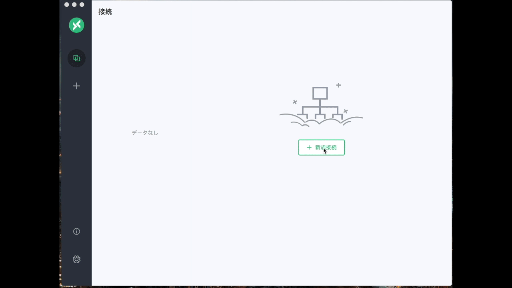

- Windows、macOS、Linuxをサポートします。
- MQTT v3.1.1 と MQTT v5.0 をサポートします。
- CA、自己署名証明書と一方向/双方向SSL証明書をサポートします。
- ライト、ダーク、ナイト(パープル)3つのテーマモードを切り替えることが可能です。
- 簡体字中国語、英語、日本語を対応しています。
- MQTTサーバーへのWebSocket接続をサポートしています。
- トピックをサブスクライブするとき、カスタムカラーマーキングをサポートします。
- $SYS トピックの自動サブスクライブをサポートし、レベルごとに拡張できます。
- Hex、Base64、JSON、Plaintextなど複数のペイロード形式をサポートします。

## ダウンロードとインストール

[GitHub Releases ](https://github.com/emqx/MQTTX/releases)から自分に合ったバージョンをダウンロードしてインストールしてください。

GitHubからのダウンロード時にネットワーク速度の低下やストールを引き起こすネットワーク上の問題がある場合は、[こちら](https://www.emqx.io/downloads/MQTTX/)をクリックして、自分に合ったバージョンを選択することもできます。

**注意**：ダウンロードの際には、最新版のダウンロードをお試しください。

- macOS

macOSユーザーの場合、Mac App Storeからダウンロードすることをお勧めします。

[](https://apps.apple.com/jp/app/mqttx/id1514074565?mt=12)

インストール用のファイルをダウンロードする場合は、`dmg`形式のインストールパッケージが好ましいです。または、`mac.zip`ファイルをダウンロードして解凍することで、すばやく使用することができます。

**注意**：ただし、 `macOS`システムのバージョンが異なると、`zip`圧縮パッケージを使用すると` 10.15.2`システムバージョンで解凍後に開くことができない場合がありますので、最初に`dmg`ファイルを選択してください。

- Windows

Windowsユーザーの方は、最新バージョンの`exe`ファイルをダウンロードしてください。ダウンロード後、Setupプロンプトに従ってインストールしてください。

- Linux

Linuxユーザーは、最新バージョンの`AppImage`あるいは`snap`ファイル使用してインストールしてください。

`snap`形式のファイルを使用してインストールする場合は、次のコマンドを実行してすばやくインストールするか、SnapStoreに直接アクセスすることもできます。

[](https://snapcraft.io/mqttx)

```shell
sudo snap install mqttx
```

**注意**： `snap`ファイルを使用してインストールする場合、インストールする権限が不十分であるという問題が発生する可能性があります。詳細については、この`issue`[https://github.com/emqx/MQTTX/issues/109]を参照してください。

## 使用する

### MQTTブローカーの準備

- MQTT Brokerをローカルにデプロイするが必要ない場合は、[EMQX](https://github.com/emqx/emqx)のオンラインパブリックBrokerを使用して簡単にテストできます。

  ```shell
  ブローカーアドレス：broker.emqx.io
  ブローカーTCPポート：1883
  ブローカーSSLポート：8883
  ```

- ローカルでMQTT Brokerを実行したい場合は、[EMQX Broker](https://github.com/emqx/emqx/releases)をインストールして使用することをお勧めします。 EMQX Brokerは、完全なオープンソース、高可用性、低レイテンシのミリオンレベルの分散型IoT MQTT 5.0メッセージサーバです。

  Dockerを使用してEMQXをインストールします。

  ```shell
  docker run -d --name emqx -p 1883:1883 -p 8083:8083 -p 8883:8883 -p 8084:8084 -p 18083:18083 emqx/emqx
  ```

### 接続を確立する

MQTT Brokerを準備したら、メインプログラムページに入り、左側のメニューバーの`+`記号をクリックします。ページにデータがない場合は、右側の[新しい接続]ボタンをクリックして、新しいクライアントを設定することもできます。

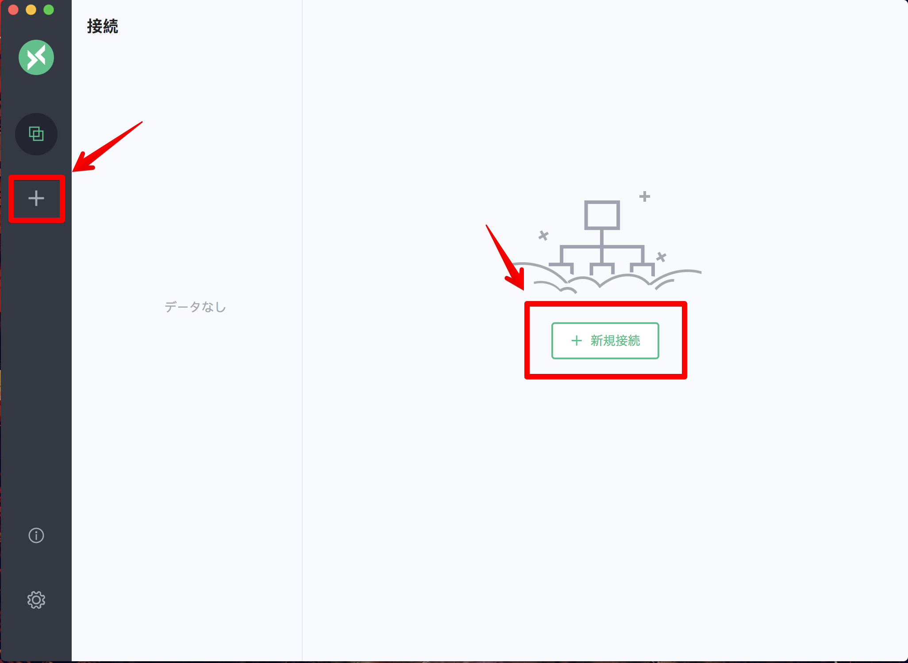

### クライアント関連情報

作成ページに入った後、クライアントに接続する関連情報を設定または入力する必要があります。

1. ブローカー情報

    `Broker`情報を設定する時、`Client ID`、 `ホスト`、および`ポート`がデフォルトで入力されました、実際の `Broker`情報に従って変更することもできます。 `Client ID`の右側にある更新ボタンをクリックして、新しい `Client ID`を生成できます。

    `ホスト`の前の選択ボックスは、接続のプロトコルを選択するために使用されます。`mqtt://`、 `ws://`をサポートします。`SSL/TLS`認証接続の場合は、`mqtts://`、`wss://`を変更してください。

    **注意**：プロトコルを変更する場合は、接続されているポートを変更する必要があります。

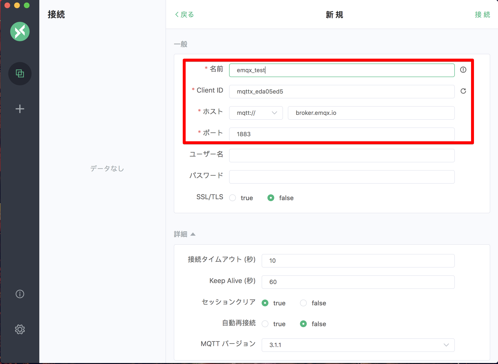

2. ユーザー認証情報

    ブローカーがユーザー認証を有効にしている場合は、設定項目に`ユーザー名` と `パスワード`の情報を入力できます。

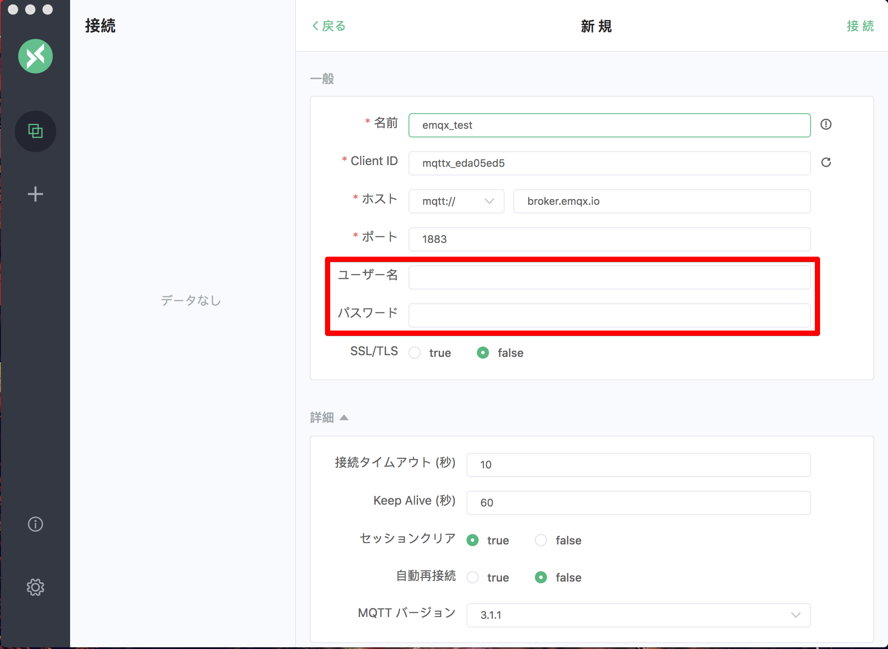

3. SSL/TLS

    `SSL/TLS`認証を有効にする必要がある場合は、設定内の`SSL/TLS`設定アイテムを `true`に設定し、`CA signed self`と`Self signed`の2つの方法を提供します。

    `Self signed`を選択するの場合、証明書を設定することが必要です。右のフォルダボタンをクリックして、生成された各証明書を選択できます。一方向接続の場合は、`CA ファイル`を選択するだけで済みます。双方向認証の場合は、`クライアント証明書` と `クライアント証明書キーファイル`を設定する必要があります。 `SSL証明書`オプションをオンにすると、より完全な証明書検証接続が有効になります。通常、正式な環境をテストするときに有効にすることをお勧めします。

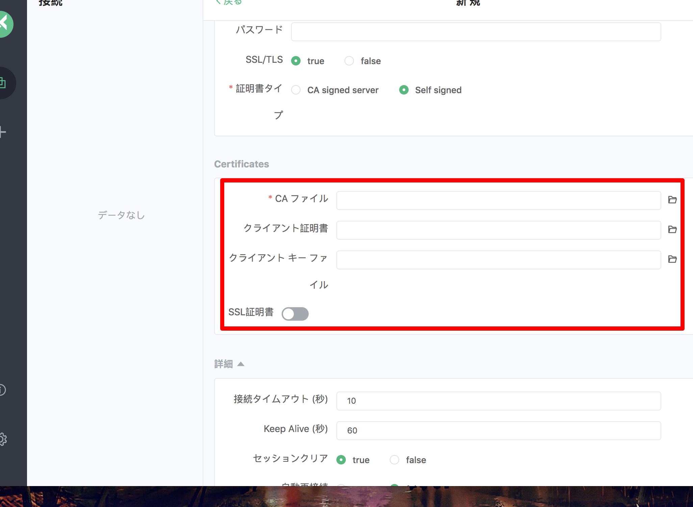

4. 詳細設定

    詳細設定では、`接続タイムアウト`、`Keep Alive`、`セッションクリア`、`自動再接続`、`MQTTバージョン`などを設定できます。

5. MQTT 5.0

    詳細設定では、MQTTのプロトコルバージョンを選択し、MQTTv3.1.1およびMQTTv5.0バージョンをサポートします。デフォルトはv3.1.1です。v5.0バージョンを選択した場合は、`セッション有効期限`、`最大受信数`、`トピックエイリアスの最大値`(オプション)も設定できます。

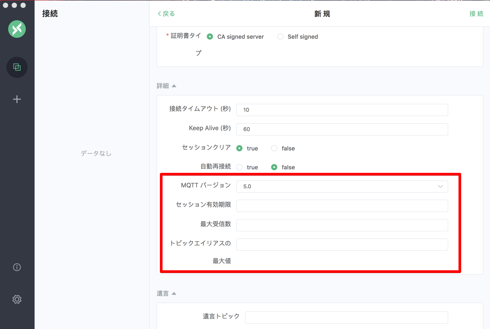

6. 遺言

    詳細設定の下にある設定カードでは、遺言を設定できます。`遺言 Qos`と`遺言 Retain`の値は、デフォルトでは 0 と `False` にパディングされます。`遺言トピック`と`遺言Payload`の値を入力した後、遺言メッセージの設定が完了します。

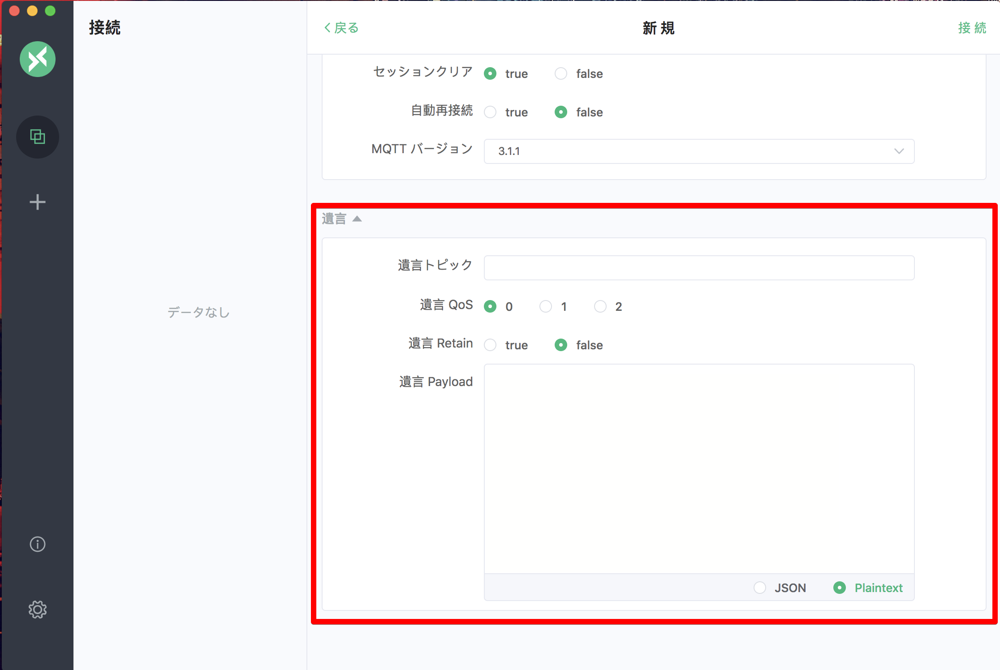

設定が完了したら、右上隅にある[接続]ボタンをクリックして、接続をすばやく作成し、MQTTブローカーに接続します。

### メッセージのPub/Sub

1. メインインターフェース

    接続が成功したら、接続のメインインターフェイスに入り、上部の接続名の横にある折りたたみボタンをクリックすると、設定のいくつかの基本情報を展開して表示できます。接続のためのいくつかの一般的な設定を簡単かつ迅速に変更することができます。設定を変更するとき、接続を切断する必要があります。もう一度`接続`をクリックして、変更された設定が有効になります。接続が成功するたびに、パネルは自動的に上向きに折りたたまれます。切断状態では、右側の設定ボタンをクリックして、接続設定をさらに変更することもできます。

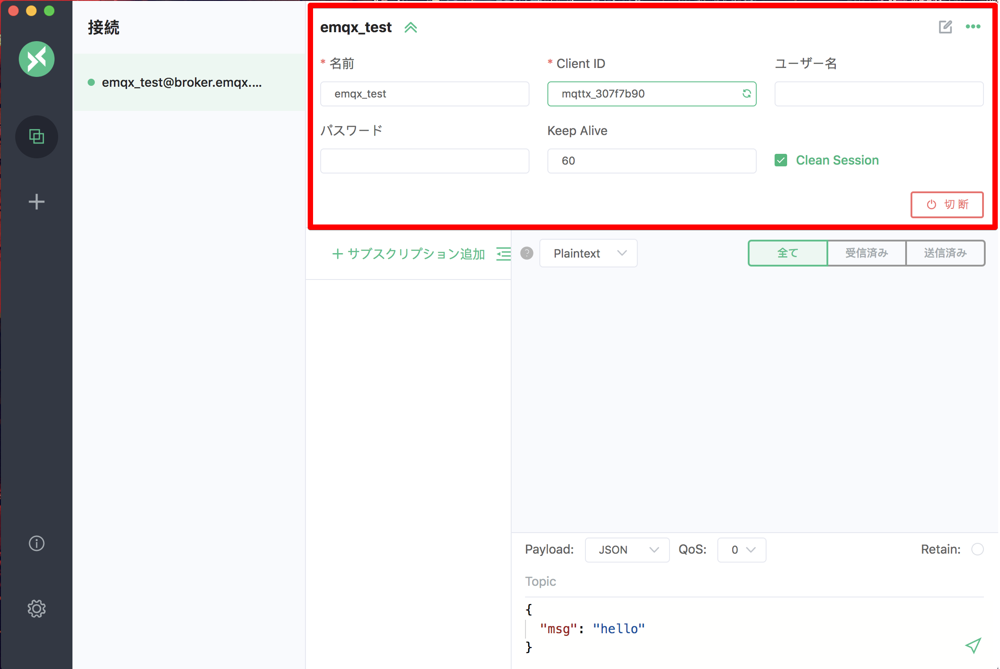

2. サブスクリプション追加

    左下隅にある`サブスクリプション追加`ボタンをクリックすると、`トピック`を追加できます。各`トピック`には色でタグを付けることができます。色はランダムに生成したり、カラーピッカーを開いて選択したりすることができます。サブスクリプションリストの上部にある右のボタンを使用すると、サブスクリプションリストを非表示にして、ページのサイズを増やすことができます。追加が完了したら、サブスクリプションリストでサブスクライブされたトピックアイテムをクリックして、メッセージフィルタリングを実行します。メッセージビューでは、現在のトピックにサブスクライブされたメッセージコンテンツのみが表示されます。もう一度クリックするとフィルタリングがキャンセルされます。また、他のサブスクライブされたトピックアイテムをクリックして、対応するメッセージを表示することもできます。トピック名をクリックして、現在のトピック情報をコピーします。トピックにメッセージを送信する必要がある場合は、メッセージバーのトピック入力ボックスに貼り付けて変更するだけで、操作をすばやく完了できます。

    `トピック`を追加する場合、トピックごとにエイリアスを設定できます。このエイリアスは非必須項目です。サブスクリプションを設定して追加すると、サブスクリプションリストの`トピック`データがエイリアスとして表示されます。マウスを`トピック`の上に置くと、プロンプト ボックスには`トピック`の元の値も表示されます。これは、監視する必要のある複数の`トピック`が長すぎて`トピック`の特定の意味を区別できない場合に非常に役立ちます。

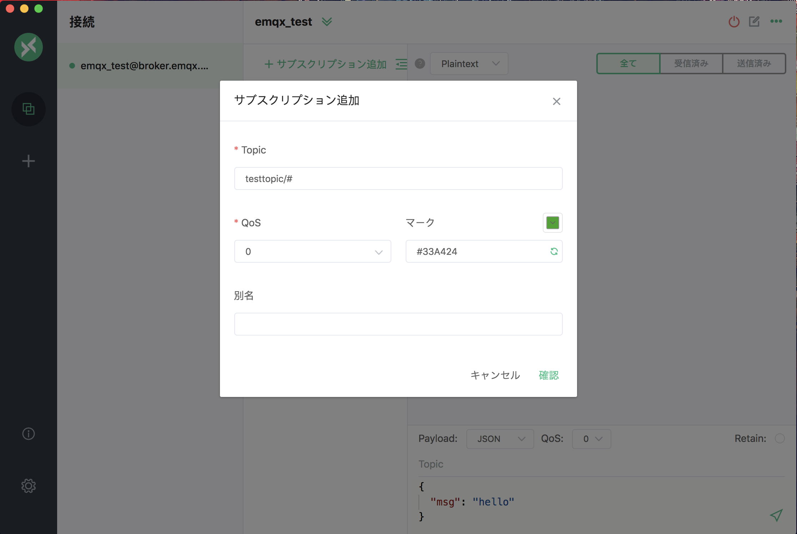

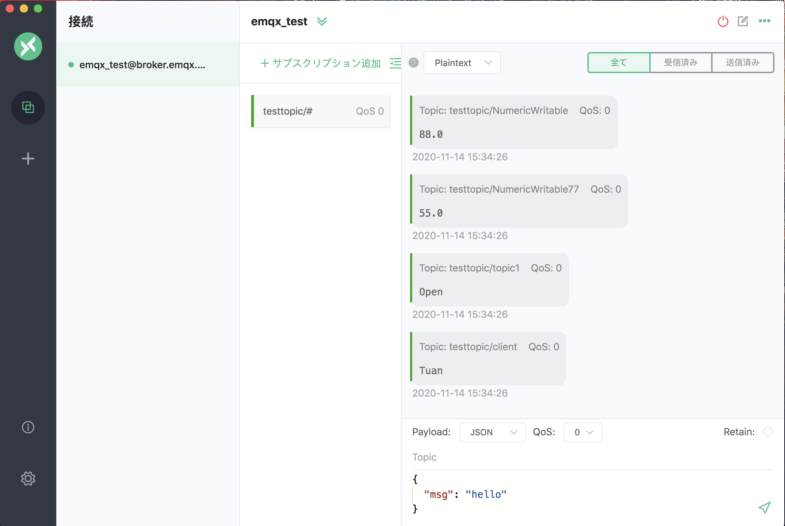

3. メッセージの送受信

    `トピック`のサブスクリプションが成功したら、メッセージの送受信をテストできます。ページの右下隅にサブスクライブしたばかりの`トピック`情報を入力し、`QoS`の値を選択するか、あるいは`Retain`を選択して、`payload`を入力して、右の送信ボタンをクリックし、該当`トピック`に送信します。正常に送信した後、送信したばかりのメッセージをすぐに受け取ることもできます。メッセージボックスでは、右の列が送信されたメッセージであることに注意してください。左の列は受信したメッセージを示しています。 macOSユーザーは `command + enter`ショートカットキーを使用でき、他のユーザーは` control + enter`ショートカットキーを使用してメッセージをすばやく送信できます。

    メッセージバーの `payload`オプションは、メッセージを複数の形式にすばやく変換することができます。`Base64`、 `Hex`、`JSON`、および `Plaintext`をサポートします。

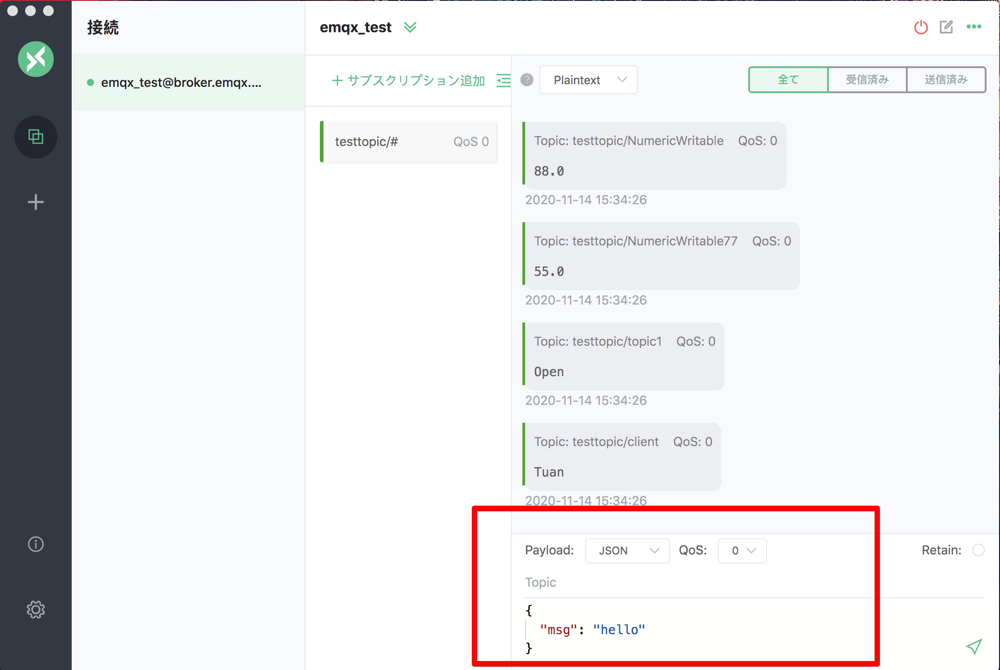

これで、 `MQTT`メッセージのテストは完了しました。

### セットアップ

左側のメニューバーの下部にある設定ボタンをクリックするか、ショートカットキーを使用すると、macOSユーザーは `command + ,`ショートカットキーを使用でき、他のユーザーは `control + ,`ショートカットキーを使用して設定ページにジャンプできます。現在、多言語を対応しています。更新を自動的にチェックしてテーマを選択するかどうか、および高度な機能のデータのバックアップと復元の機能をオンにします。

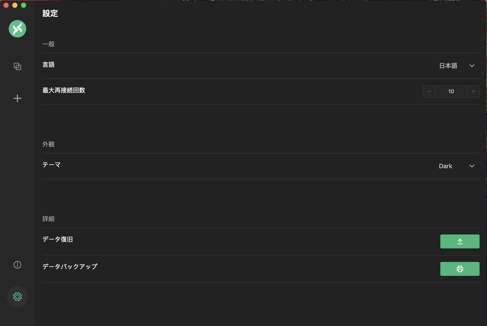

#### データ管理

詳細設定には、データのバックアップおよびバックアップ機能が含まれます。ユーザーは、接続ページの右上隅にあるメニューから、または設定ページの詳細機能バーから、2つのインポートとエクスポートの方法を選択することができます。

設定ページで、下部の詳細機能においてデータバックアップボタンとデータ復元ボタンをクリックできます。データバックアップボタンをクリックすると、送受信されたすべてのメッセージを含むすべての接続データをエクスポートできます。データバックアップボタンをクリックすると、インポートしたファイルのパスを選択した後、すべてのデータをバックアップできます。ファイルフォーマットは `JSON`, `XML`, `CSV`, `Excel` がサポートされています。

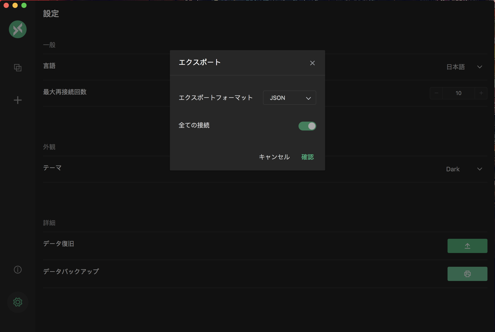

### 脚本

v1.4.2以降、MQTTXはスクリプト編集機能を追加しました、この機能では、ユーザーはカスタムスクリプト（JavaScript）を記述して、送受信される「ペイロード」をカスタマイズできます。また、タイミング送信機能を使用すると、シミュレートされたデータレポートの自動テスト機能を実現できます。

> 注：この機能は現在ベータ段階です。

左側のメニューバーにある[スクリプト]ボタンをクリックして、スクリプト編集ページに入ります。このページでは、ユーザーは上部のコードエディタでJavaScriptコードを記述できます。グローバルに実行できるAPIは1つだけで、ユーザーはスクリプト関数を作成する必要があります。関数は `Payload`である` value`パラメーターを受け取り、関数をカスタマイズして `value`を変更し、最後に関数をパラメーターとして` execute`に渡してカスタムを実行します。 -書かれた関数。


下に「input」ボックスと「output」ボックスもあります。期待される入力値を入力できます。右側の「test」ボタンをクリックすると、「output」ボックスに実行結果が表示されます。入力値の形式には次のものがあります。 `JSON`` Plaintext`を使用すると、ユーザーがカスタム作成されたスクリプト関数を事前にデバッグするのに便利です。テストが完了したら、右上隅にある[保存]ボタンをクリックし、スクリプトの名前を入力してスクリプトを保存できます。保存後、接続ページに移動して使用できます。保存したスクリプトは、編集および削除することもできます。

接続ページで、右上隅のドロップダウンメニューをクリックし、[スクリプトを使用]を選択し、ポップアップウィンドウで、使用する必要のある保存済みのスクリプトを選択してから、次のようなアプリケーションの種類を選択します。送信時、受信時、およびすべて。選択が完了したら、データの種類に応じて送受信するデータ形式を選択し、メッセージの送受信を通常どおりに行います。このとき、期待通りの効果が見られれば、スクリプトの全機能が完了します。ユーザーがスクリプトをキャンセルする必要がある場合は、上部のステータスバーにある赤い[スクリプトの停止]ボタンをクリックして、スクリプトの使用を停止できます。

この機能にはある程度のスケーラビリティと柔軟性があり、ユーザーは実際に使用する必要性に協力する必要があります。


スクリプトの使用例は [/docs/script-example](https://github.com/emqx/MQTTX/tree/master/docs/script-example) フォルダーで表示できます。現在、タイムスタンプ変換と温度および湿度データシミュレーションの2つの組み込みスクリプトが提供されています。より優れた実用的なスクリプトを使用している場合は、ここにコードを送信して、より多くの人が使用できるようにすることもできます。

### ログ

v1.5.0以降、MQTT Xは、ユーザーが接続をデバッグしてエラーを報告するのを容易にするロギング機能を導入しました。実稼働環境では、ログシステムは次の3つのレベルの情報を表示します。

- INFO は、ユーザー操作情報を求めるために使用されます
- WARN は、危険/潜在的なリスクの警告を生成します
- ERROR は失敗したエラーを生成します

デフォルトでは、ログはログファイルに書き込まれます。

- Linux: `~/.config/MQTTX/logs/log`
- macOS: `~/Library/Application Support/MQTTX/logs/log`
- Windows: `%USERPROFILE%\AppData\Roaming\MQTTX\logs\log`

MQTTXが閉じられるたびに、現在のログファイルの名前がタイムスタンプ `[YY]-[MM]-[DD]T[hh]-[mm]-[ss].log`形式に変更されます。


### その他

1. 接続操作

    上部のアクションバーのボタンをクリックすると、現在の接続をすばやく切断したり、接続を削除したり、データをインポートしたりエクスポートしたりすることができます。

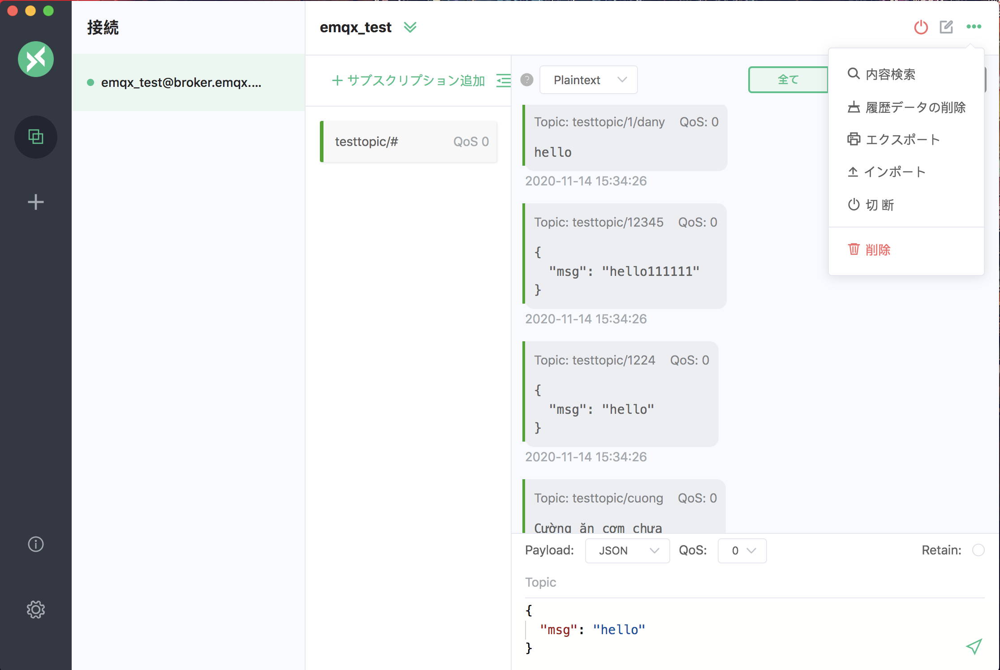

2. メッセージ処理

    メッセージバーの右上隅にある`すべて`、`受信済み`、`送信済み`ボタンで、すべてのメッセージ、受信したメッセージ、公開されたメッセージをフィルタリングすることができます。

    上部のアクションバーのボタンをクリックして、`内容検索`項目を選択するか、ショートカットキーを使用すると、macOSユーザーは`command + f`ショートカットキーを使用でき、他のユーザーは`control + f`ショートカットキーを使用して`トピック`を押して検索を開くことができます。サブスクリプションのファジークエリをサポートします。

    上部のアクションバーボタンをクリックして、`履歴データの削除`項目を選択して、現在の接続で送受信されたメッセージをすばやくクリアします。

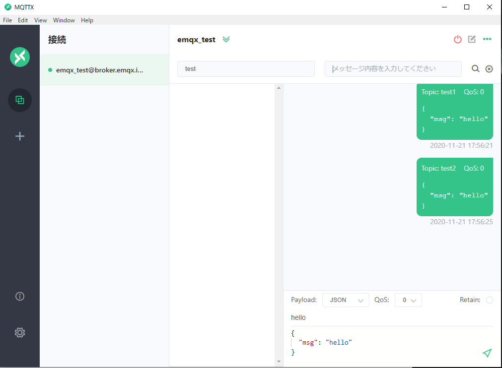

3. アップデート

    [MQTT X](https://mqttx.app)のバージョン情報と[EMQX](https://emqx.io)のバージョン情報については、左下の`i`ボタンをクリックして`About`画面で確認できます。 `バージョンチェック`をクリックして、アップデートされたバージョンがあるかどうかを確認します。

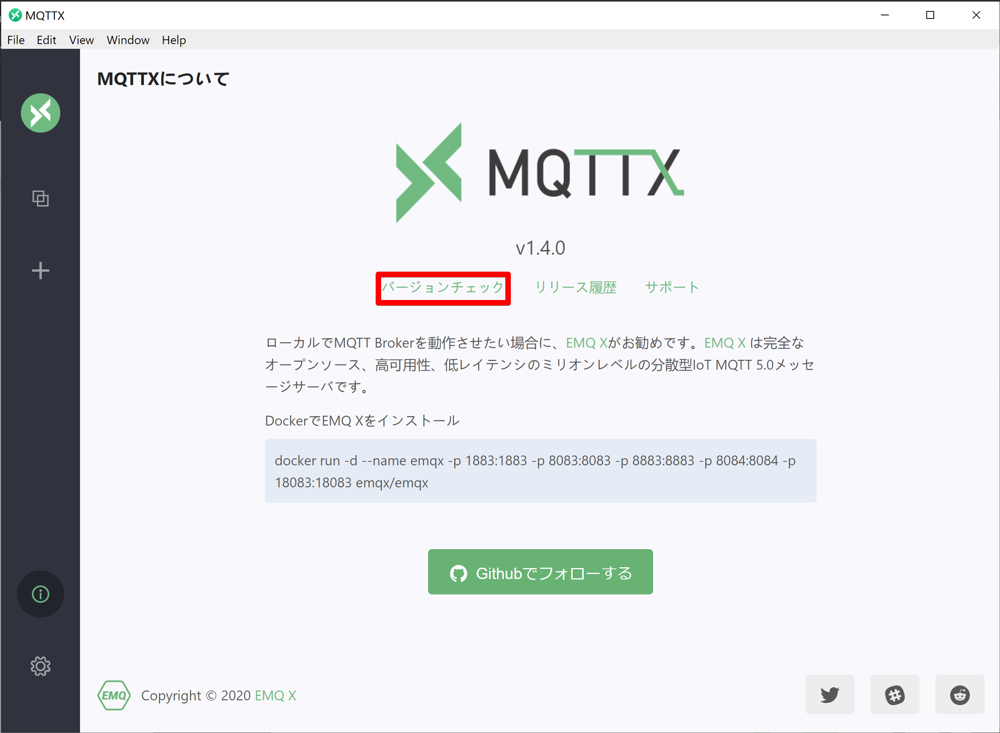

4. 再接続の最大数

    自動更新チェックの下には、整数に設定できる再接続の最大数項目があります。`Broker`が切断された場合、または、接続に失敗した場合、再接続数がこの値を超えると接続が完全に切断されます。

5. マルチウィンドウ
    接続リストで、右クリックして[新しいウィンドウ]を選択し、接続用の新しいウィンドウを作成します。 新しいウィンドウでは、接続、トピックのサブスクライブ、メッセージの公開と受信などもできます。
    作成された複数の接続間に接続がある場合、または、同時に受信したメッセージを表示する必要がある場合は、複数のビューウィンドウを作成して同時に表示することができます。

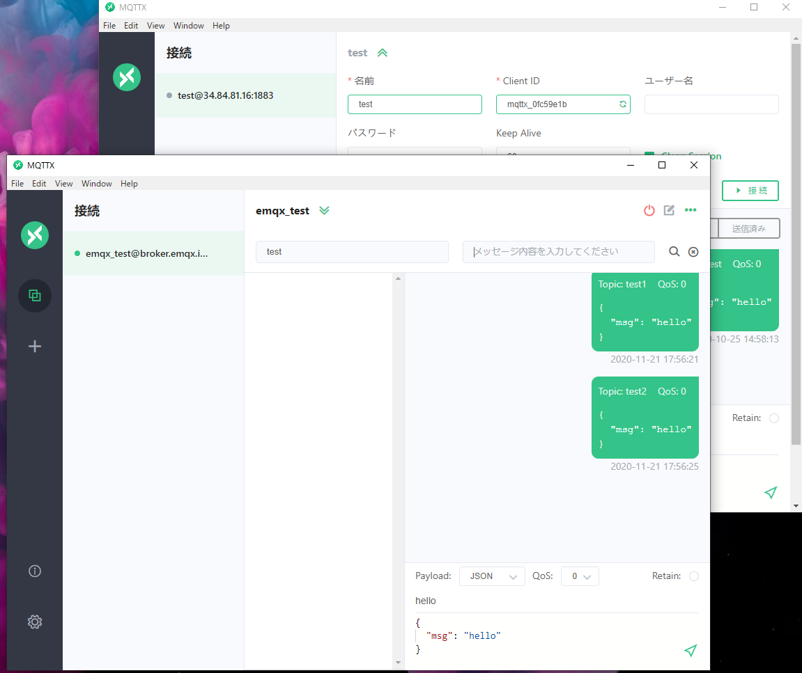

## 開発ガイド

開発マシンにおいて　`Node`、`Git`環境が必要であり、`npm`、`Vue.js`、`Electron`、`TypeScript`などの関連知識を理解している必要があります。

``` shell
# Fork & Cloneプロジェクト
git clone git@github.com:${name}/MQTTX.git

# インストールの依存関係
cd MQTTX
yarn install

# コンパイルとホットリロードして開発を始める
yarn run electron:serve

# コンパイルと圧縮して、製品バージョンをビルドする
yarn run electron:build
```

ビルドが成功すると、インストーラーが `dist_electron`ディレクトリに表示されます

指定されたオペレーティングシステムのインストールパッケージのみをビルドする必要がある場合は、 `package.json`の中に`electron：build`に対応するコマンドラインステートメントを変更してください。

macOS: `vue-cli-service electron:build --mac`

Windows: `vue-cli-service electron:build --win`

Linux: `vue-cli-service electron:build --linux`

## FAQ

**Q：MQTTクライアントとは何ですか？**A.

MQTTクライアントとは、MQTTライブラリを実行し、ネットワーク経由でMQTTブローカーに接続されているあらゆるデバイスのことです。 パブリッシャーとサブスクライバーは、クライアントが現在、メッセージを発行しているか、あるいはメッセージを受信するためにサブスクライブしているかを意味します。 基本的にはテスト用です。 つまり、TCP/IPプロトコルでMQTTサービスに接続するあらゆる機器やソフトウェアをMQTTクライアントと呼ぶことができる、と簡単に理解できる。

**Q: なぜMQTT Xを使うのですか？**

MQTT Xは、オープンソースでクロスプラットフォームのMQTTデスクトップクライアントツールです。 MQTT用のメッセージングサーバーを独自に構築しているユーザーや、MQTT Brokerを開発しているユーザーで、接続テストやメッセージのサブスクライブ、パブリッシュなど、MQTTの勉強をしているユーザーが利用できます。 ユーザーは複数の接続クライアントを素早く設定し、MQTT/TCP、MQTT/TLS接続、パブリッシュ/サブスクライブ機能などを素早くテストすることができます。 MQTT Xでは、MQTTの研究やアプリケーションにおいて、MQTTプロトコル関連の機能を素早くかつ深く理解することができます。

**Q：MQTT Xがチャットソフトのデザインを採用した理由を教えてください。**

MQTTプロトコルのpublish-subscribeの理解に基づき、ユーザーAを想定した新しいコネクションの作成、トピックへのサブスクライブ（チャットチャンネルへの参加）、ユーザーBを想定した新しいコネクションの作成、ユーザーAがサブスクライブしたトピックへのメッセージの投稿など、MQTTプロトコルのコアコンテンツをユーザーがすぐに理解できるように、チャットソフトウェアのインタラクティブな形態を採用しています。 ユーザーBからのメッセージを、ユーザーAのページで受け取ることができます。 実はIoTの世界でも、MQTTのパブリッシュ・サブスクライブ機能を使ってデバイス同士が通信することができます。 MQTT Xはこれをエミュレートしてユーザーインターフェースに変換し、ユーザーがMQTT関連のコンテンツをより早く理解してテストできるようにしています。

**Q：MQTT Xは無料ですか？**

はい。 完全なオープンソースです。詳細は[LICENSE](https://github.com/emqx/MQTTX/blob/master/LICENSE)をご覧ください。

**Q：MQTT Xで問題が発生した場合はどうしますか？**

1.MQTT Xの[GitHub](https://github.com/emqx/MQTTX)リンクを開き、[issue](https://github.com/emqx/MQTTX/issues?q=is%3Aissue+is%3Aopen+)にアクセスしてください。 sort%3Aupdated-desc)のエリアに移動し、問題を送信するをクリックしてフィードバックを与える。 2.
2.中国のユーザーは、私たちの[EMQ Q&Aコミュニティ](https://askemq.com/c/tools/11)でフィードバックをすることができます。 3.
最後に、お客様がお持ちの問題についてフィードバックをいただくために、下記の連絡先からご連絡いただけます。

## 連絡先

- [EMQX Slack](https://slack-invite.emqx.io/)
- [Twitter](https://twitter.com/EMQTech)
- [Forum](https://groups.google.com/d/forum/emqtt)
- [Blog](https://emqx.medium.com/)
- [Reddit](https://www.reddit.com/r/emqx/)
