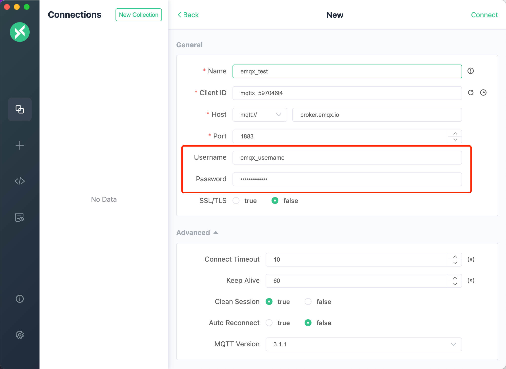
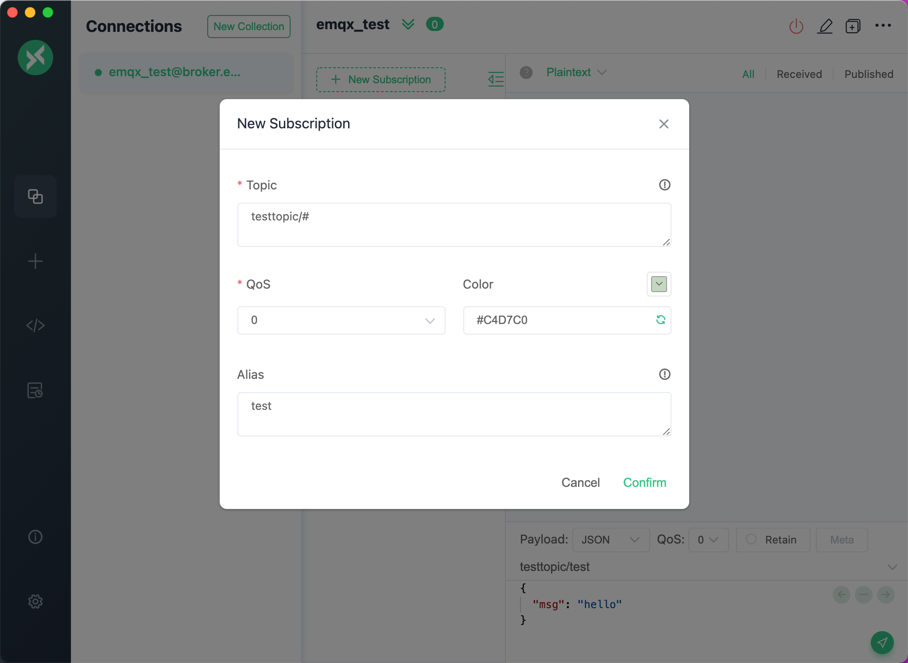
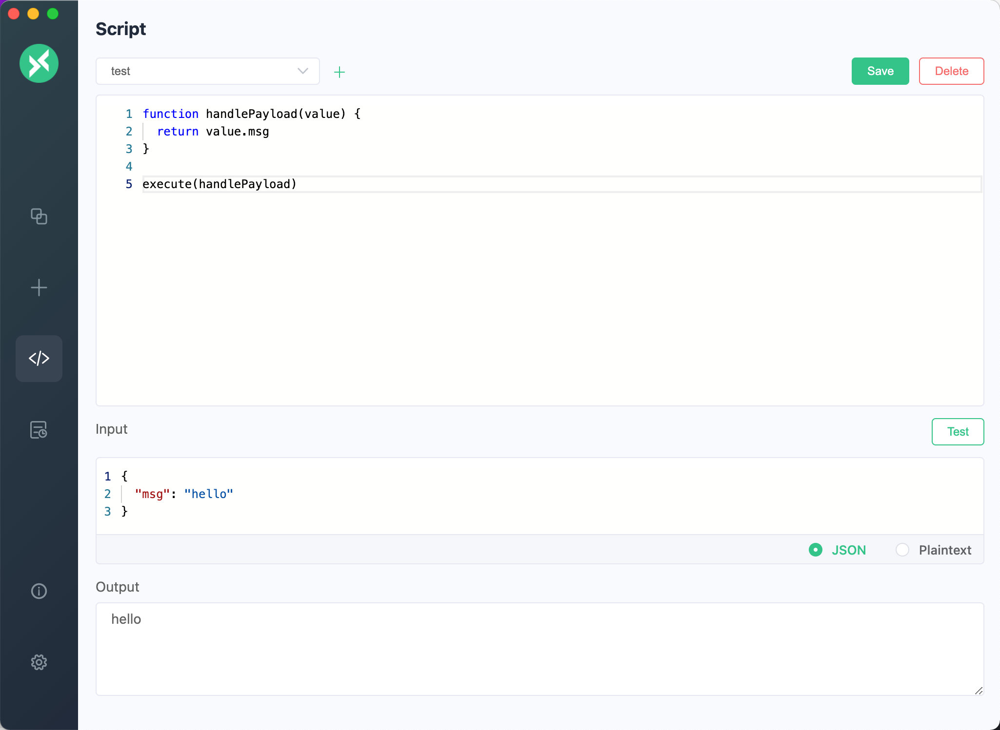
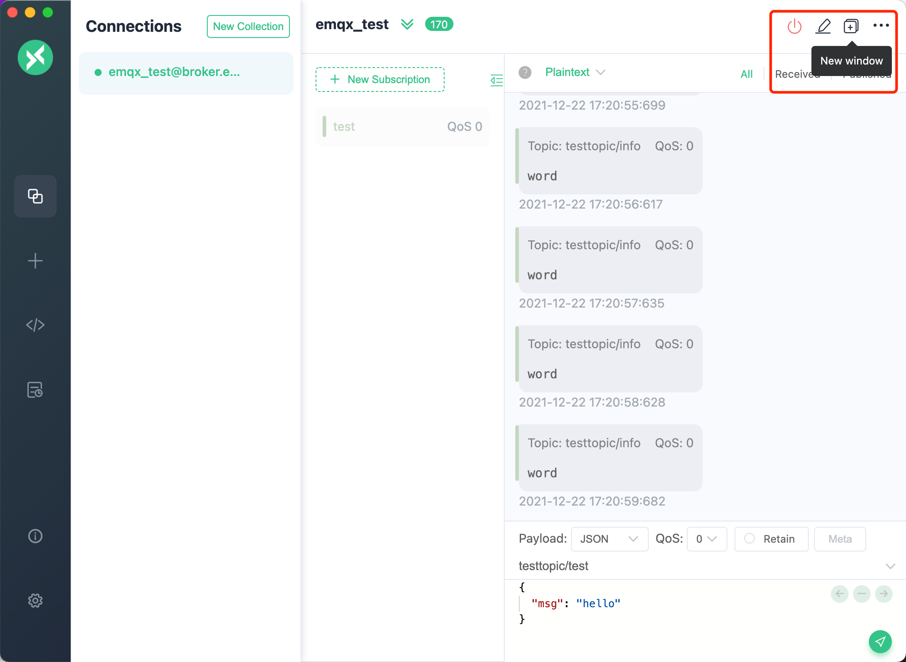
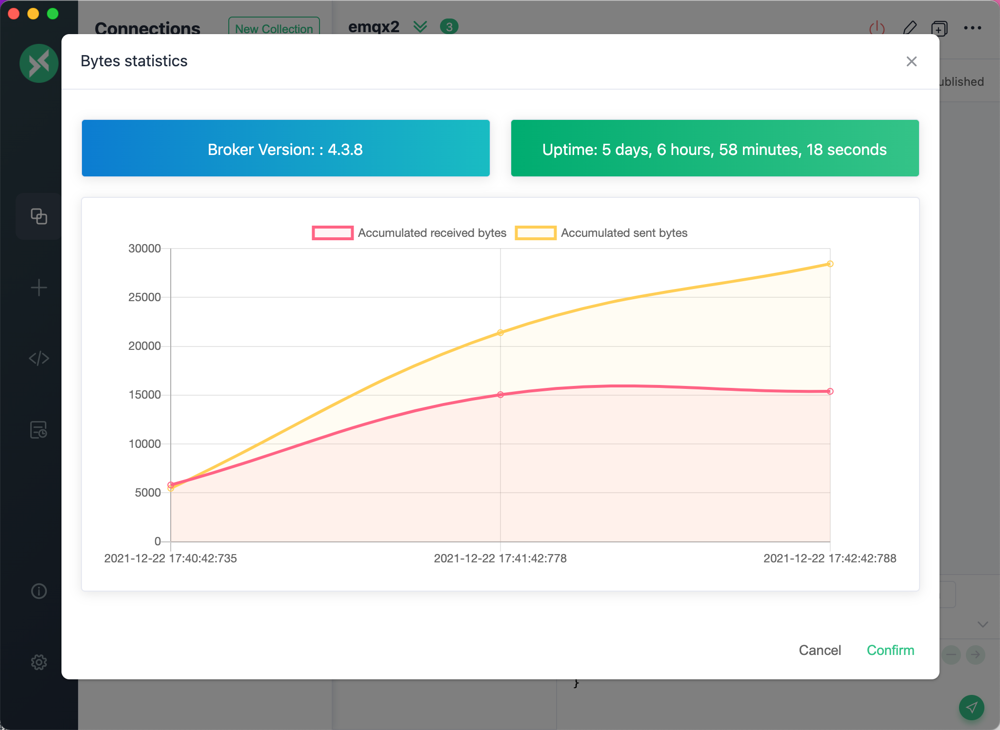

# MQTT X  manual

## Table of Contents

- [Introduction](#Introduction)
- [Downloading and installation](#Downloading-and-Installation)
- [Usage](#Usage)
- [Development Guide](#Development-Guide)

## Introduction

[MQTT X](https://mqttx.app) is an elegant cross-platform MQTT 5.0 desktop client open-sourced by [EMQ](http://emqx.io/cn), which supports macOS, Linux, Windows.

The `UI` of [MQTT X](https://mqttx.app) adopts the form of chat interface, which simplifies the page operation logic. It allows  users to quickly create connections and save multiple clients, which facilitate users to quickly test the `MQTT/MQTTS` connection, as well as the subscription and publication of `MQTT` messages.

Before downloading and installing, please visit our [website](https://mqttx.app) or [GitHub](https://github.com/emqx/MQTTX) to understand and obtain the latest version information. The latest version helps improve the usage experience. If you are familiar with this project, you can also directly clone the repository source code of [MQTT X](https://mqttx.app)  and build and use it by yourself. During the using process, if you have any questions, you can go to  [GitHub issues](https://github.com/emqx/MQTTX/issues) to express questions and opinions or fork our project, and submit the modified PR to us. We will review and reply carefully.

### Preview


- Cross-platform, support Windows, macOS, Linux
- Supports MQTT v3.1.1 and MQTT v5.0
- Support CA, self-signed certificate, and single and two-way SSL authentication
- Theme switching between Light, Dark and Night(purple)
- Support Simplified Chinese and English
- Support MQTT over WebSockets
- Support for color customization when subscribing Topic
- Support for automatic subscription to $SYS and hierarchical expansion
- Support multiple payload formats of Hex, Base64, JSON, Plaintext

## Downloading and Installation

Please download the suitable version from [GitHub Releases](https://github.com/emqx/MQTTX/releases) and install it for use.

If there are network reasons that cause slow network speeds or jam when downloading from GitHub, you can also click [here](https://www.emqx.io/downloads/MQTTX/) and select the versions that matches your requirement and install it.

**Note**: When downloading, please choose to download the latest version whenever possible.

- macOS

For macOS users, it is recommended to download from the Mac App store.

[](https://apps.apple.com/us/app/mqttx/id1514074565?mt=12)

When you need to download files to install, it is recommended to download the installation package file in `dmg` format first. They can also choose to download the compressed file of `mac.zip`, which can be used quickly after decompression.

**Note**: However, for different `macOS` system versions, `zip` compression package may not be opened after decompression in the `10.15.2` system version. Please prefer the `dmg` file.

- Windows

For Windows users, please download the latest version of the `exe` file. After downloading, user can install it according to the instructions of Setup.

- Linux

For Linux users, please download the latest version of the `AppImage` file or use the snap file for quick installation.

For installation using `snap` file, you can also execute this command to quickly install or visit Snap Store:

[](https://snapcraft.io/mqttx)

```shell
sudo snap install mqttx
```

**Note**: When installing with `snap` files, there may be a problem of insufficient permissions. For details, refer to this `issue` [https://github.com/emqx/MQTTX/issues/109](https://github.com/emqx/MQTTX/issues/109)

## Usage

### MQTT Broker preparation

- If you don't need to deploy MQTT Broker locally, you can use the online public version of [EMQ X](https://github.com/emqx/emqx) for quick testing;

  ```shell
  Broker address: broker.emqx.io
  Broker TCP port: 1883
  Broker SSL port: 8883
  ```

- If you plan to deploy a MQTT Broker running locally, we recommend you to [download EMQ X](https://github.com/emqx/emqx/releases) for installation and use. EMQ X broker is a fully open source, highly scalable, highly available distributed MQTT messaging broker for IoT, M2M and Mobile applications that can handle tens of millions of concurrent clients.

  Install EMQ X by using Docker:

  ```shell
  docker run -d --name emqx -p 1883:1883 -p 8083:8083 -p 8883:8883 -p 8084:8084 -p 18083:18083 emqx/emqx
  ```

### Quickly establish a connection

When MQTT Broker is ready, you can click `+` in the left menu bar to enter the main program page. If there is no data on the page, you can also directly click the `new connection` button on the right to quickly configure a new client connection.


### Client related information

After entering the creation page, it is required to configure or fill in the relevant information for connecting to the client.

1. Broker information

   When configuring the `Broker` information,`Client ID`, `Host`, and `Port` are already filled in by default. You can also modify it by yourself based on the actual `Broker` information. Click the refresh button to the right of `Client ID` to quickly generate a new `Client ID`.

   The drop-down box in front of `Host` is used to select the connection protocol, which supports `mqtt: //`, `ws: //`. If an `SSL / TLS` authentication connection is used, it needs to be modified to `mqtts: //`. , `Wss: //`.

    **Note**: When the protocol is modified, the connection port needs to be modified.


2. User authentication information

   If your broker has enabled user authentication, you can fill in the information of `Username` and `Password` in the configuration item.



3. SSL/TLS

   When you need to enable `SSL/TLS` authentication, you only need to set the `SSL/TLS` configuration item in the configuration as `true`. The two methods,`CA signed self` and `Self signed` are provided.

   If `Self signed` is selected, certificate configuration can be performed. Click the folder button on the far right to select the certificates you have generated. If it is a one-way connection, you only need to select your `CA File`. If it is a two-way authentication, you also need to select to configure `Client Certificate File` and `Client key file`. When the option of `Strict validate Certificate` is enabled, a more complete certificate verification connection will be enabled. It is generally recommended to enable it when you need to test the production environment.


4. Advanced configuration

   In advanced configuration, you can configure `Connection Timeout Duration`, `KeepAlive`, `Clean Session`, `Auto Reconnect`, `MQTT Version`, etc.

5. MQTT 5.0

   In the advanced configuration, you can select the protocol version of MQTT, including MQTT v3.1.1 and MQTT v5.0, and the default is v3.1.1. If you choose v5.0, you can also configure `Session Expiry Interval`, `Receive Maximum` and `Topic Alias Maximu` (optional).


6. Will Message

    Below the advanced configuration, you can configure the Will Message. The values of `Last-Will-QoS` and `Last-Will-Retain` are filled with 0 and `False` by default. When you enter the values of `Last-Will-Topic` and `Last-Will-Payload`, you can complete the configuration of Will Message.


After the configuration is complete, click the `Connect` button in the upper right corner to quickly create a connection and connect to MQTT Broker.

### Publish and subscription of message

1. Main interface

   After the connection is successful, you can enter the main interface of the connection. Click the fold button next to the connection name at the top to expand and display some basic information of the configuration. It is convenient to quickly modify several commonly used configurations of the connection. You need to disconnect when modifying, and click connect again to take effect. After each successful connection, the panel will automatically fold up. In the disconnected state, you can also click the configuration button on the right to modify more connection configurations.


2. Add subscription

   Click the `New Subscription` button in the lower left corner to quickly add a Topic. Each Topic can be marked with a color, which can be randomly generated or opened by the color selector. The rightmost button at the top of the subscription list can hide the subscription list to show more space on the page. After the addition is complete, click on the subscribed Topic items in the subscription list to achieve message filtering. The message view will only display the message content subscribed to the current topic. Click again to cancel the filter; You can also directly click other subscribed Topic items to view the corresponding message content. By clicking on the topic name, you can quickly copy the current topic information. When you need to send a message to this topic, you can quickly paste it into the topic input box of the message bar to modify it, and you can quickly complete the operation.

   When adding `Topic`, you can set an alias for each Topic. This option is an optional. When the subscription is set and added, the `Topic` in the subscription list will be displayed as an alias, and the mouse over the `Topic` item, the prompt box will also display the original value of the `Topic`. This is very helpful when multiple `Topics` that need to be monitored are too long to distinguish the specific meaning of `Topic`.




3. Sending and receiving of messages

   After the `Topic` is successfully subscribed, you can test the sending and receiving of messages. Fill in the `Topic` information you just subscribed to in the lower right corner of the page. You can select the values of `QoS`, `Retain`, input `payload`, and click the send button on the far right to send a message to the `Topic` you just subscribed. After sending successfully, you can immediately receive the message just sent. Note that in the message box, the right column is the sent message, and the left column is the received message. MacOS users can use the `command + enter` shortcut to quickly send messages, and other users can use the `control + enter` shortcut to do that.

   Through the `payload` option in the message bar, the messages can quickly be converted into multiple formats, such as `Base64`, `Hex`,`JSON` and `Plaintext`.


So far, the test of an `MQTT` message is completed.

### Setting

Click the settings button at the bottom of the left menu bar, or use shortcut. MacOS users can use the `command +,` shortcut, and other users can use the `control +,` shortcut to jump to the settings page. Currently, language selection is supported, whether to automatically check for updates, select topics is enabled and also data backup and recovery functions in advanced settings.


#### Data management

The advanced settings include data backup and recovery functions. Users can choose two import and export ways, or through the upper right menu in the connection page, or in the advanced bar in the settings page.

In the settings page, you can choose to click the data backup and data recovery buttons in the advanced functions at the bottom. When selecting data backup, all connection data will be exported, including all received and sent messages. When selecting data recovery, after selecting the path of the imported file, the data can be recovered after confirmation. The file format supports `JSON`, `XML`, `CSV` and `Excel`.


### Script

After the v1.4.2 version, MQTT X has added a script editing function. In this function, users can write custom scripts (JavaScript) to perform custom conversions on sent and received `Payload`. With the timing sending function, realize the automated test function for the simulation data report.

> Note: This feature is test feature in the beta stage

Click the `script` button in the menu bar on the left to enter the script editing page. In this page, users can write JavaScript code in the code editor at the top. There is only one `execute` API globally, and the user needs write a script function that receives a `value` parameter, which is `Payload`, and the function can be customized to modify the `value`, and finally the function can be executed by passing it as a parameter to the `execute` custom-written functions.

There is also an `input` and `output` box below. You can enter the expected input value. Click the `test` button on the right to view the execution result in the `output` box. The format of the input value includes `JSON` With `Plaintext`, it is convenient for users to debug custom-written script functions in advance. After completing the test, you can click the `Save` button in the upper right corner and enter the name of the script to save the script. After saving, you can go to the connection page for use. The saved script can also be edited and deleted.

In the connection page, click the drop-down menu in the upper right corner, select `Use script`, in the pop-up window, select the pre-saved script you need to use, and then select the script to be applied, including: Published, Received, and All. After the selection is completed, select the data format to be sent or received according to the data type, and use the message sending and receiving normally. At this time, if the expected effect is seen, a script function is completed. If the user needs to cancel the script, you can click the red `Stop script` button in the top status bar to stop using the script.

This function is scalable and flexible, and requires users to cooperate with actual needs to use it.



The script usage examples can be viewed in the [/docs/script-example](https://github.com/emqx/MQTTX/tree/master/docs/script-example) folder. Currently, two built-in scripts are provided, timestamp conversion and temperature and humidity data simulation. If you have a better and more practical script in your use, you can submit your code here, so that more people can use it.

### Log

After v1.5.0, MQTT X has introduced a logging function to facilitate users to debug connections and report errors. In a production environment, the log system displays 3 levels of information:

- INFO is used to prompt user operation information
- WARN generates a warning of unsafe/potential risks
- ERROR produces a failed error

By default, the log will be written to the log file:

- Linux: `~/.config/MQTTX/logs/log`
- macOS: `~/Library/Application Support/MQTTX/logs/log`
- Windows: `%USERPROFILE%\AppData\Roaming\MQTTX\logs\log`

Every time MQTTX is closed, the current log file will be renamed to timestamp `[YY]-[MM]-[DD]T[hh]-[mm]-[ss].log` format.

### Others

1. Connection operation

   By clicking the action bar button at the top, you can quickly disconnect, delete the current connection, import and export of current data, timed message and bytes statistics etc.


2. Message processing

   Through the `All`,`Received`, `Published` buttons in the upper right corner of the message bar, you can filter out all messages, received messages and published messages.

Click the action bar button at the top and select the `Search`  item, or use the shortcut key. MacOS users can use the command + f shortcut and Other users can use the control + f shortcut  to open the `Topic` search function, the fuzzy query of topics and payload is supported.

Click on the action bar button at the top and select the `Clear History` item, you can quickly clear the messages sent and received by the current connection.


3. Check update

   Click the `i` button at the bottom left to enter the `About` page to learn about the version information of [MQTT X](https://mqttx.app) and related information of [EMQ X](https://emqx.io) . Click `Check for Updates` to check if there are newer versions.


4. Max reconnection times

    Below the automatic check update, there is a setting for the maximum number of reconnections, which can be set as an integer. When the 'broker' is disconnected or the connection is unavailable, the connection will be completely disconnected if the number of reconnections exceeds this setting value.

5. Multi-window

    In the connection list, right-click and select `New window` to create a new window for the connection. In the new window, you can also connect, subscribe to topics, publish and receive messages, etc. If there is a connection between multiple connections created, or you need to view messages received at the same time, you can create multiple view windows and view them at the same time. After v1.4.1, users can also click the window button at the top to quickly create a new window.




6. Bytes statistics

    In the drop-down menu in the upper right corner, you can click on the `Bytes statistics` item, MQTT X will automatically subscribe to the system topic, and can display the simple `Bytes statistics` chart, version and uptime of the MQTT Broker on the page.

    > By default, only MQTT clients on localhost is allowed to subscribe to the $ SYS topic. Please refer to build-in ACL to modify the ACL rules for publish and subscription.



7. Timed message

    In the drop-down menu in the upper right corner, you can click the `Timed message` item to set the sending frequency in seconds. After the setting is completed, manually send a message, and the message will be automatically sent according to the set sending frequency.


## Development Guide

When developing, you need to have `Node`, `Git` environment in the local machine, and need to know about `npm`,`Vue.js`, `Electron`,`TypeScript` and other related knowledge.

```shell
# Fork & Clone project
git clone git@github.com:${name}/MQTTX.git

# Install dependencies
cd MQTTX
yarn install

# Compile and hot reload for development
yarn run electron:serve

# Compile and compress to build a production version
yarn run electron:build
```

After the building is successful, the corresponding installation file for the successful build ing will appear in the `dist_electron` directory.

If you only need to build the installation package of the specified system, please modify the command line statement corresponding to `electron: build` in `package.json`:

macOS: `vue-cli-service electron:build --mac`

Windows: `vue-cli-service electron:build --win`

Linux: `vue-cli-service electron:build --linux`

## FAQ

**Q: What is the MQTT Client?**

The MQTT client is that any device runs the MQTT library and connects to the MQTT Broker over the network. Publishers and subscribers refer to the client currently is publishing messages or subscribing to receive them. publishers and subscribers can be the same MQTT client, (publishing and subscribing functionality can also be implemented in the same MQTT client). an MQTT client can be a very small device with limited resources, or it can be a typical piece of computer software running a graphical user interface MQTT client, basically for testing purposes. So it can be simply understood that any device or software that connects to the MQTT service over the TCP/IP protocol can be called an MQTT client.

**Q: Why use MQTT X?**

MQTT X is an open source cross-platform MQTT desktop client tool. It can be used by users who are building their own messaging servers for MQTT, or by users who are developing MQTT Broker and studying and learning about MQTT to test connections, subscribe and publish messages, etc. Users can quickly set up multiple connection clients to quickly test MQTT/TCP, MQTT/TLS connections, publish/subscribe functionality and other features. MQTT X provides a quick, in-depth understanding of MQTT protocol-related features for MQTT research and applications.

**Q: Why does MQTT X use the UI design of chat software?**

Based on the understanding of the MQTT protocol of pub/sub model, MQTT X simplifies the operation logic of the page with the help of chatting software. For example, create a new connection as a User A, subscribe to a Topic, just like to join a chat channel, and then create a new connection as a User B, publish a message to the Topic that User A has subscribed to, we can receive the message from User B in User A's page. In fact, in the IoT world as well, devices can use pub/sub feature of MQTT to communicate with each other. MQTT X emulates this and translates it into the user interface to help users understand and test MQTT-related content faster.

**Q: What do you do when you have problems with MQTT X?**

1. You can visit the [GitHub](https://github.com/emqx/MQTTX) for MQTT X, go to the [issue](https://github.com/emqx/MQTTX/issues?q=is%3Aissue+is%3Aopen+sort%3Aupdated-desc) tab and click on submit issue to give feedback.
2. or you can go to our GitHub [Discussions](https://github.com/emqx/MQTTX/discussions) tab to give feedback.
3. Finally, you can contact us at the community information below to give us feedback on any issues you may have.

## Community, discussion, contribution, and support

You can reach the EMQ community and developers via the following channels:

- [EMQX Slack](https://slack-invite.emqx.io/)
- [Twitter](https://twitter.com/EMQTech)
- [Forum](https://groups.google.com/d/forum/emqtt)
- [Blog](https://emqx.medium.com/)
- [Reddit](https://www.reddit.com/r/emqx/)
