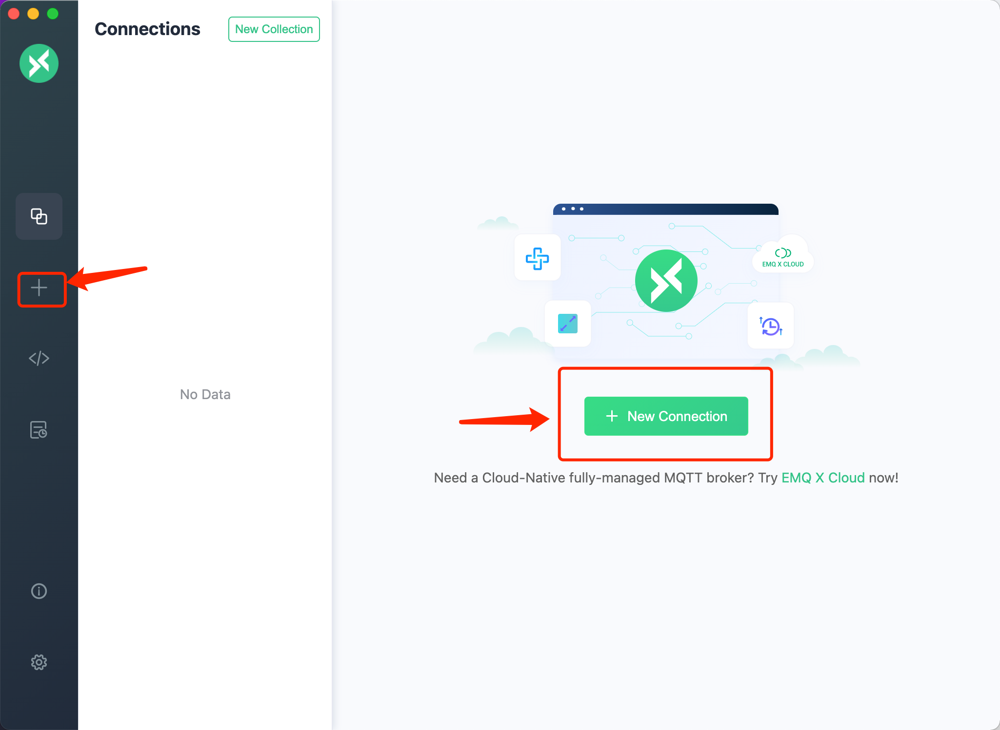
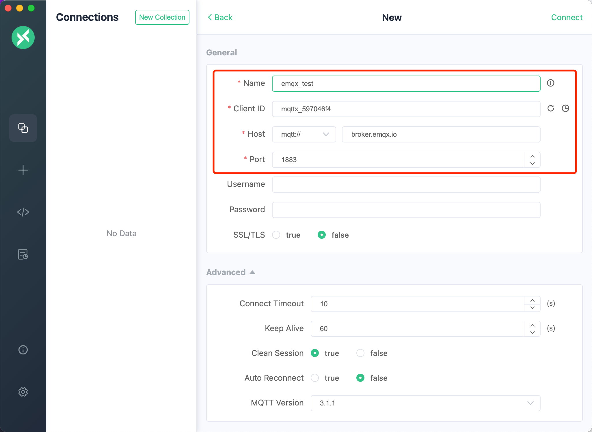
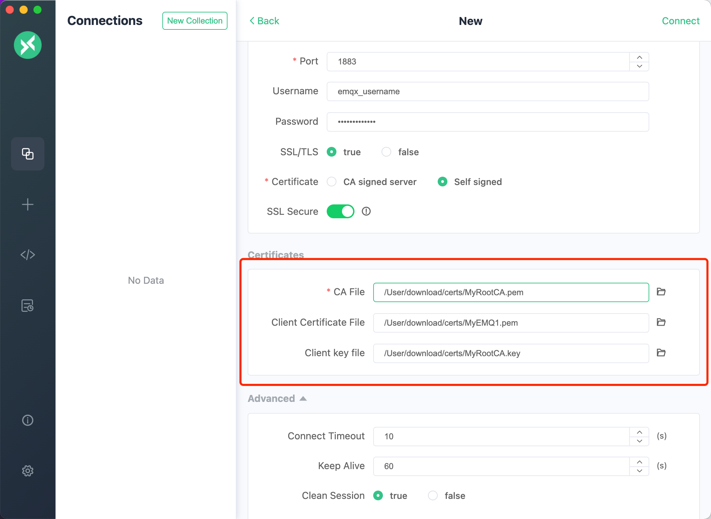
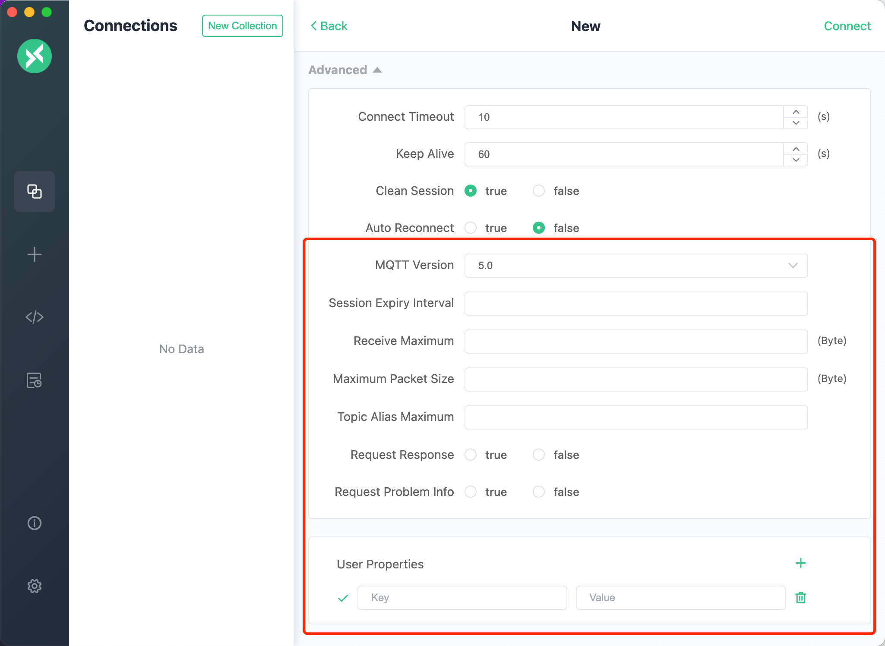
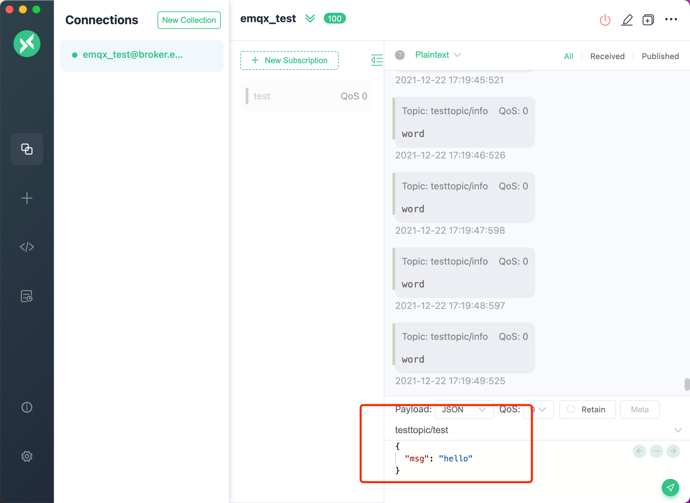
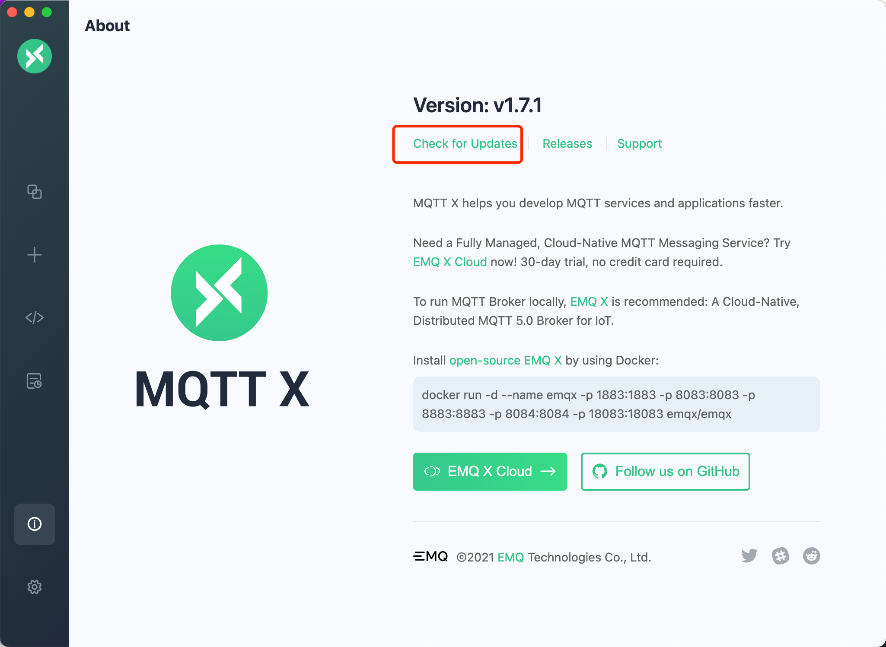

# MQTT X  manual

## Table of Contents

- [Introduction](#Introduction)
- [Downloading and installation](#Downloading-and-Installation)
- [Usage](#Usage)
- [Development Guide](#Development-Guide)

## Introduction

[MQTT X](https://mqttx.app) is an elegant cross-platform MQTT 5.0 desktop client open-sourced by [EMQ](http://emqx.io/cn), which supports macOS, Linux, Windows.

The `UI` of [MQTT X](https://mqttx.app) adopts the form of chat interface, which simplifies the page operation logic. It allows  users to quickly create connections and save multiple clients, which facilitate users to quickly test the `MQTT/MQTTS` connection, as well as the subscription and publication of `MQTT` messages.

Before downloading and installing, please visit our [website](https://mqttx.app) or [GitHub](https://github.com/emqx/MQTTX) to understand and obtain the latest version information. The latest version helps improve the usage experience. If you are familiar with this project, you can also directly clone the repository source code of [MQTT X](https://mqttx.app)  and build and use it by yourself. During the using process, if you have any questions, you can go to  [GitHub issues](https://github.com/emqx/MQTTX/issues) to express questions and opinions or fork our project, and submit the modified PR to us. We will review and reply carefully.

### Preview


- Cross-platform, support Windows, macOS, Linux
- Supports MQTT v3.1.1 and MQTT v5.0
- Support CA, self-signed certificate, and single and two-way SSL authentication
- Theme switching between Light, Dark and Night(purple)
- Support Simplified Chinese and English
- Support MQTT over WebSockets
- Support for color customization when subscribing Topic
- Support for automatic subscription to $SYS and hierarchical expansion
- Support multiple payload formats of Hex, Base64, JSON, Plaintext

## Downloading and Installation

Please download the suitable version from [GitHub Releases](https://github.com/emqx/MQTTX/releases) and install it for use.

If there are network reasons that cause slow network speeds or jam when downloading from GitHub, you can also click [here](https://www.emqx.io/downloads/MQTTX/) and select the versions that matches your requirement and install it.

**Note**: When downloading, please choose to download the latest version whenever possible.

- macOS

MacOS users are encouraged to download the installation package file in `dmg` format first. They can also choose to download the compressed file of `mac.zip`, which can be used quickly after decompression.

**Note**: However, for different `macOS` system versions, `zip` compression package may not be opened after decompression in the `10.15.2` system version. Please prefer the `dmg` file.

- Windows

For Windows users, please download the latest version of the `exe` file. After downloading, user can install it according to the instructions of Setup.

- Linux

For Linux users, please download the latest version of the `AppImage` file or use the snap file for quick installation.

**Note**: When installing with `snap` files, there may be a problem of insufficient permissions. For details, refer to this `issue` [https://github.com/emqx/MQTTX/issues/109](https://github.com/emqx/MQTTX/issues/109)

## Usage

### MQTT Broker preparation

- If you don't need to deploy MQTT Broker locally, you can use the online public version of [EMQ X](https://github.com/emqx/emqx) for quick testing;

  ```shell
  Broker address: broker.emqx.io
  Broker TCP port: 1883
  Broker SSL port: 8883
  ```

- If you plan to deploy a MQTT Broker running locally, we recommend you to [download EMQ X](https://github.com/emqx/emqx/releases) for installation and use. EMQ X broker is a fully open source, highly scalable, highly available distributed MQTT messaging broker for IoT, M2M and Mobile applications that can handle tens of millions of concurrent clients.

  Install EMQ X by using Docker:

  ```shell
  docker run -d --name emqx -p 1883:1883 -p 8083:8083 -p 8883:8883 -p 8084:8084 -p 18083:18083 emqx/emqx
  ```

### Quickly establish a connection

When MQTT Broker is ready, you can click `+` in the left menu bar to enter the main program page. If there is no data on the page, you can also directly click the `new connection` button on the right to quickly configure a new client connection.



### Client related information

After entering the creation page, it is required to configure or fill in the relevant information for connecting to the client.

1. Broker information

   When configuring the `Broker` information,`Client ID`, `Host`, and `Port` are already filled in by default. You can also modify it by yourself based on the actual `Broker` information. Click the refresh button to the right of `Client ID` to quickly generate a new `Client ID`.

   The drop-down box in front of `Host` is used to select the connection protocol, which supports `mqtt: //`, `ws: //`. If an `SSL / TLS` authentication connection is used, it needs to be modified to `mqtts: //`. , `Wss: //`.

    **Note**: When the protocol is modified, the connection port needs to be modified.



2. User authentication information

   If your broker has enabled user authentication, you can fill in the information of `Username` and `Password` in the configuration item.


3. SSL/TLS

   When you need to enable `SSL/TLS` authentication, you only need to set the `SSL/TLS` configuration item in the configuration as `true`. The two methods,`CA signed self` and `Self signed` are provided.

   If `Self signed` is selected, certificate configuration can be performed. Click the folder button on the far right to select the certificates you have generated. If it is a one-way connection, you only need to select your `CA File`. If it is a two-way authentication, you also need to select to configure `Client Certificate File` and `Client key file`.



4. Advanced configuration

   In advanced configuration, you can configure `Connection Timeout Duration`, `KeepAlive`, `Clean Session`, `Auto Reconnect`, `MQTT Version`, etc.

5. MQTT 5.0

   In the advanced configuration, you can select the protocol version of MQTT, including MQTT v3.1.1 and MQTT v5.0, and the default is v3.1.1. If you choose v5.0, you can also configure `Session Expiry Interval`, `Receive Maximum` (optional).



6. Will Message

    Below the advanced configuration, you can configure the Will Message. The values of `Last-Will-QoS` and `Last-Will-Retain` are filled with 0 and `False` by default. When you enter the values of `Last-Will-Topic` and `Last-Will-Payload`, you can complete the configuration of Will Message.


After the configuration is complete, click the `Connect` button in the upper right corner to quickly create a connection and connect to MQTT Broker.

### Publish and subscription of message

1. Main interface

   After the connection is successful, you can enter the main interface of the connection. Click the fold button next to the connection name at the top to expand and display some basic information of the configuration. It is convenient to quickly modify several commonly used configurations of the connection. You need to disconnect when modifying, and click connect again to take effect. After each successful connection, the panel will automatically fold up. In the disconnected state, you can also click the configuration button on the right to modify more connection configurations.


2. Add subscription

   Click the `New Subscription` button in the lower left corner to quickly add a Topic. Each Topic can be marked with a color, which can be randomly generated or opened by the color selector. The rightmost button at the top of the subscription list can hide the subscription list to show more space on the page.


3. Sending and receiving of messages

   After the `Topic` is successfully subscribed, you can test the sending and receiving of messages. Fill in the `Topic` information you just subscribed to in the lower right corner of the page. You can select the values of `QoS`, `Retain`, input `payload`, and click the send button on the far right to send a message to the `Topic` you just subscribed. After sending successfully, you can immediately receive the message just sent. Note that in the message box, the right column is the sent message, and the left column is the received message. MacOS users can use the `command + enter` shortcut to quickly send messages, and other users can use the `control + enter` shortcut to do that.

   Through the `payload` option in the message bar, the messages can quickly be converted into multiple formats, such as `Base64`, `Hex`,`JSON` and `Plaintext`.



So far, the test of an `MQTT` message is completed.

### Setting

Click the settings button at the bottom of the left menu bar, or use shortcut. MacOS users can use the `command +,` shortcut, and other users can use the `control +,` shortcut to jump to the settings page. Currently, language selection is supported, and whether to automatically check for updates and select topics is enabled.


### Others

1. Connection operation

   By clicking the action bar button at the top, you can quickly disconnect, delete the current connection.


2. Message processing

   Through the `All`,`Received`, `Published` buttons in the upper right corner of the message bar, you can filter out all messages, received messages and published messages.

Click the action bar button at the top and select the `Search by Topic`  item, or use the shortcut key. MacOS users can use the command + f shortcut and Other users can use the control + f shortcut  to open the `Topic` search function, the fuzzy query of topics is supported.

Click on the action bar button at the top and select the `Clear Histroy` item, you can quickly clear the messages sent and received by the current connection.


3. Check update

   Click the `i` button at the bottom left to enter the `About` page to learn about the version information of [MQTT X](https://mqttx.app) and related information of [EMQ X](https://emqx.io) . Click `Check for Updates` to check if there are newer versions.



4. Max reconnection times

    Below the automatic check update, there is a setting for the maximum number of reconnections, which can be set as an integer. When the 'broker' is disconnected or the connection is unavailable, the connection will be completely disconnected if the number of reconnections exceeds this setting value.

## Development Guide

When developing, you need to have `Node`, `Git` environment in the local machine, and need to know about `npm`,`Vue.js`, `Electron`,`TypeScript` and other related knowledge.

```shell
# Fork & Clone project
git clone git@github.com:${name}/MQTTX.git

# Install dependencies
cd MQTTX
yarn install

# Compile and hot reload for development
yarn run electron:serve

# Compile and compress to build a production version
yarn run electron:build
```

After the building is successful, the corresponding installation file for the successful build ing will appear in the `dist_electron` directory.

If you only need to build the installation package of the specified system, please modify the command line statement corresponding to `electron: build` in `package.json`:

macOS: `vue-cli-service electron:build --mac`

Windows: `vue-cli-service electron:build --win`

Linux: `vue-cli-service electron:build --linux`

## Community, discussion, contribution, and support

You can reach the EMQ community and developers via the following channels:

- [EMQX Slack](https://slack-invite.emqx.io/)
- [Twitter](https://twitter.com/emqtt)
- [Forum](https://groups.google.com/d/forum/emqtt)
- [Blog](https://medium.com/@emqtt)
- [Reddit](https://www.reddit.com/r/emqx/)
