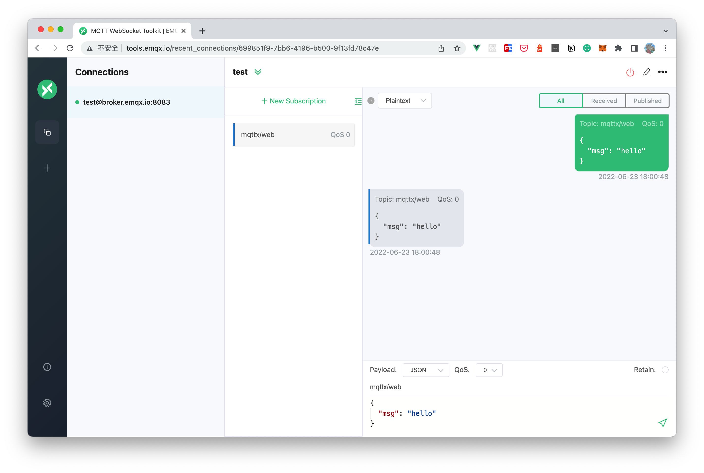

# MQTT X Web application

[](https://github.com/emqx/mqttx/releases)


[](https://github.com/emqx/mqttx/releases)
[](https://slack-invite.emqx.io/) [](https://discord.gg/xYGf3fQnES)
[](https://github.com/emqx/MQTTX/discussions)
[](https://www.youtube.com/channel/UC5FjR77ErAxvZENEWzQaO5Q)
[](https://twitter.com/EMQTech)

---

[MQTT X](https://mqttx.app) is an open source MQTT 5.0  client.

> [MQTT](http://mqtt.org/faq) stands for MQ Telemetry Transport. It is a publish/subscribe, extremely simple and lightweight messaging protocol, designed for constrained devices and low-bandwidth, high-latency or unreliable networks.

## Preview



## Project setup

```
yarn install
```

### Compiles and hot-reloads for development

```
yarn serve
```

### Compiles and minifies for production

```
yarn build
```

### Run your end-to-end tests

```
yarn test:e2e
```

### Lints and fixes files

```
yarn lint
```

### Customize configuration

See [Configuration Reference](https://cli.vuejs.org/config/).
