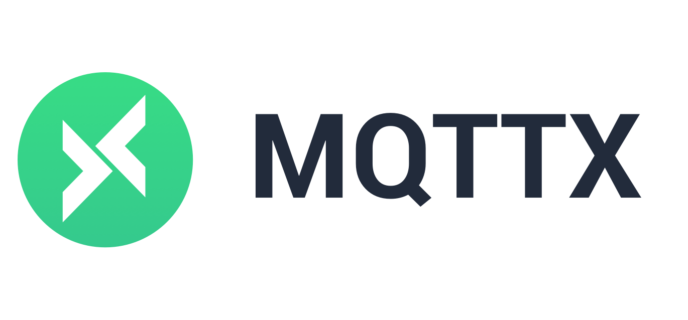
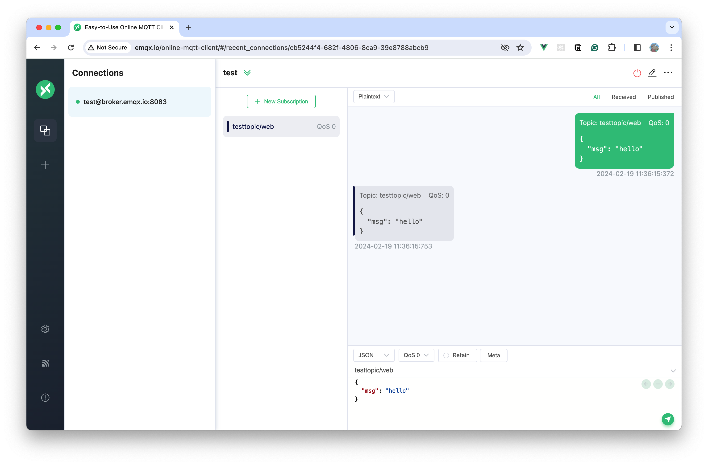

# MQTT X Web

[](https://github.com/emqx/mqttx/releases)

[](https://github.com/emqx/mqttx/releases)
[](https://hub.docker.com/r/emqx/mqttx-web)
[](https://slack-invite.emqx.io/) [](https://discord.gg/xYGf3fQnES)
[](https://github.com/emqx/MQTTX/discussions)
[](https://www.youtube.com/channel/UC5FjR77ErAxvZENEWzQaO5Q)
[](https://twitter.com/EMQTech)

English | [简体中文](./README-CN.md)

---

[MQTT X Web](https://mqttx.app) is an open source MQTT 5.0 browser client and an online MQTT WebSocket client tool. Use WebSocket to connect to MQTT in your browser to help you develop and debug your MQTT services and applications faster without having to download and install MQTT X locally.

> [MQTT](http://mqtt.org/faq) stands for MQ Telemetry Transport. It is a publish/subscribe, extremely simple and lightweight messaging protocol, designed for constrained devices and low-bandwidth, high-latency or unreliable networks.

## Preview



## Usage

Visit MQTT WebSocket Client (MQTT X Web): [http://www.emqx.io/online-mqtt-client](http://www.emqx.io/online-mqtt-client)

## Deploy from Docker Image

```bash
docker pull emqx/mqttx-web:latest

docker run -d --name mqttx-web -p 80:80 emqx/mqttx-web:latest
```

## Better Together with EMQX

MQTT X is designed to connect to test MQTT Brokers such as EMQX, The one-click connection and simple graphical interface make it easy to connect to EMQX or EMQX Cloud to debug and explore functional features.

[Sign up EMQX Cloud for 14 days free trial](https://www.emqx.com/en/try?product=cloud)

[Download EMQX locally right now](https://www.emqx.com/en/try?product=enterprise)

## Get Involved

- Follow [@EMQTech on Twitter](https://twitter.com/EMQTech).
- If you have a specific question, check out our [discussion forums](https://github.com/emqx/emqx/discussions).
- For general discussions, join us on the [official Discord](https://discord.gg/xYGf3fQnES) team.
- Keep updated on [EMQX YouTube](https://www.youtube.com/channel/UC5FjR77ErAxvZENEWzQaO5Q) by subscribing.

## Develop

Recommended version for Node environment:

- v16.\*.\*

``` shell
# Clone
git clone git@github.com:emqx/MQTTX.git

# Install dependencies
cd MQTTX/web
yarn install

# Compiles and hot-reloads for development
yarn run serve

# Compiles and minifies for production
yarn run build

# Compiles for production & serve generated files of site locally
yarn run start
```

## Contributing

Please make sure to read the [Contributing Guide](https://github.com/emqx/MQTTX/blob/master/.github/CONTRIBUTING.md) before making a pull request.

## Technology Stack

- [Vue](https://vuejs.org/) + [Element](https://element.eleme.io)
- [TypeScript](https://www.typescriptlang.org/)
- [MQTT.js](https://github.com/mqttjs/MQTT.js)

## License

Apache License 2.0, see [LICENSE](https://github.com/emqx/MQTTX/blob/master/LICENSE).
